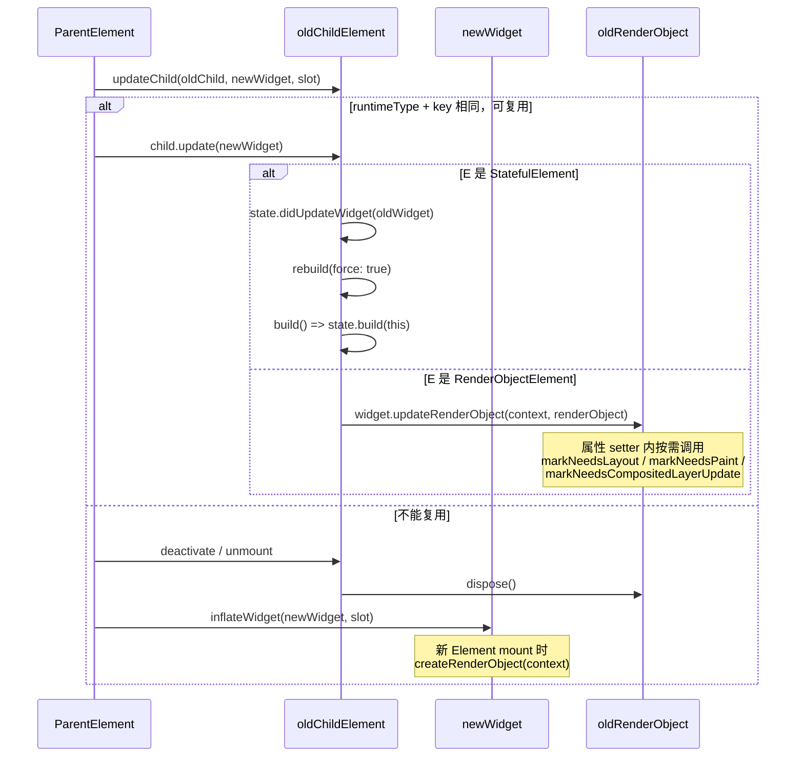

> 延伸面试题已拆到：[Flutter延伸面试题事件启动图片缓存性能.md](/Users/huchu/Desktop/test-flutter-mix/flutter_study/Docs/Flutter延伸面试题事件启动图片缓存性能.md:1)。本文主线聚焦三棵树、Element 复用、State 生命周期、RenderObject 和 slot。

```dart
/// 这是从 Flutter `framework.dart` 中摘出来的学习片段，
/// 目的不是单独运行，而是专门用来理解 Element 复用和渲染链路。
///
/// Flutter 框架里最核心的“子节点更新入口”之一。
///
/// 可以把它理解成：
/// 1. 当前父 Element 已经拿到了这一次 build 产出的 newWidget
/// 2. 它现在要决定：旧的 child Element 能不能继续复用
/// 3. 如果能复用，就调用 child.update(newWidget)
/// 4. 如果不能复用，就销毁旧 child，再为 newWidget 创建新的 Element
///
/// 这也是 Flutter 复用机制的关键设计：
/// - 新的一侧传进来的是 Widget，因为 Widget 是“新的声明式配置”
/// - 旧的一侧传进来的是 Element，因为 Element 才是“运行时实例”
///
/// 注意：复用 Element != 一定不会重新渲染。
/// - 复用 Element 只是说明生命周期、位置、State、RenderObject 有机会继续保留
/// - 但如果配置变了，后续仍然可能触发 rebuild / relayout / repaint
///
/// 站在“当前父 Element”的视角：
/// - child: 这个槽位上旧的子 Element
/// - newWidget: 这次想放到这个槽位上的新 Widget
/// - newSlot: 子节点在父节点里的位置标记，比如列表里的索引/槽位
Element? updateChild(Element? child, Widget? newWidget, Object? newSlot) {
  // 情况 1：新的配置为空。
  // 这说明父节点这次 build 后，这个位置不再需要子节点了。
  // 所以如果旧 child 存在，就把它从树上摘掉并进入 deactivate 流程。
  if (newWidget == null) {
    if (child != null) {
      deactivateChild(child);
    }
    return null;
  }

  final Element newChild;
  if (child != null) {
    // hasSameSuperclass 是一个调试期保护。
    // 它主要用于避免热重载后“Stateless/Stateful 形态变化”导致旧 Element 和新 Widget 类型体系不匹配，从而错误复用。
    bool hasSameSuperclass = true;

    assert(() {
      final int oldElementClass = Element._debugConcreteSubtype(child);
      final int newWidgetClass = Widget._debugConcreteSubtype(newWidget);
      hasSameSuperclass = oldElementClass == newWidgetClass;
      return true;
    }());


    if (hasSameSuperclass && child.widget == newWidget) {
        // 情况 2：child.widget == newWidget
        //
        // 这是最快路径：旧 Element 里保存的 widget 实例，和这次传进来的newWidget 是“同一个对象”。
        //
        // 既然配置对象本身都没变，那就连 update 都不需要做；
        // 只需要在 slot 变动时修正位置信息，然后直接复用旧 child。
      if (child.slot != newSlot) {
        updateSlotForChild(child, newSlot);
      }
      newChild = child;


    } else if (hasSameSuperclass && Widget.canUpdate(child.widget, newWidget)) {
          // 情况 3：虽然不是同一个 Widget 实例，但仍然可以复用。
          //
          // Widget.canUpdate 的核心判断是：
          // - runtimeType 相同
          // - key 相同
          //
          // 满足这两个条件，框架就认为“旧 Element 还能服务这次新的配置”，
          // 因此不需要销毁旧 Element，而是让旧 Element 吃下新的 Widget。
      if (child.slot != newSlot) {
        updateSlotForChild(child, newSlot);
      }

      // 下面这段是性能分析打点。
      // profile/debug 下如果开启了构建追踪，会把这次 update 记录到时间线中，
      // 方便在 DevTools 里观察 rebuild 开销。
      final bool isTimelineTracked =
          !kReleaseMode && _isProfileBuildsEnabledFor(newWidget);
      if (isTimelineTracked) {
        Map<String, String>? debugTimelineArguments;
        assert(() {
          if (kDebugMode && debugEnhanceBuildTimelineArguments) {
            debugTimelineArguments =
                newWidget.toDiagnosticsNode().toTimelineArguments();
          }
          return true;
        }());
        FlutterTimeline.startSync('${newWidget.runtimeType}',
            arguments: debugTimelineArguments);
      }

      // 这里是“复用”的真正落点：
      // 不是创建新的 Element，而是让旧 child.update(newWidget)。
      //
      // 对于不同 Element 子类，update 内部会继续做自己的事：
      // - StatelessElement: 重新执行 build
      // - StatefulElement: 更新 widget 引用，必要时 didUpdateWidget，再决定 rebuild
      // - RenderObjectElement: 比较配置后更新底层 RenderObject
      //
      // 所以这里保住的不只是 Element 本身，
      // 往往还包括：
      // - BuildContext 身份
      // - StatefulWidget 对应的 State
      // - RenderObject
      //
      // 这正是 Flutter 高性能的关键：Widget 可以经常重建，
      // 但更“贵”的运行时对象尽量复用。
      child.update(newWidget);
      if (isTimelineTracked) {
        FlutterTimeline.finishSync();
      }
      assert(child.widget == newWidget);
      assert(() {
        child.owner!._debugElementWasRebuilt(child);
        return true;
      }());
      newChild = child;

    } else {

      // 情况 4：旧 child 无法复用。
      //
      // 常见原因：
      // - runtimeType 变了
      // - key 变了
      // - 调试期发现 Element/Widget 形态不匹配
      //
      // 这时只能把旧 child 退场，再为 newWidget 创建全新的 Element。
      deactivateChild(child);
      assert(child._parent == null);

      newChild = inflateWidget(newWidget, newSlot);
    }
  } else {
    // 情况 5：旧 child 本来就不存在。
    // 这是首次挂载的场景，直接根据 newWidget 创建新的 Element。
    newChild = inflateWidget(newWidget, newSlot);
  }

  // 下面这段也是调试期逻辑，主要是维护 GlobalKey 的占用关系。
  // GlobalKey 允许节点跨位置移动后仍保留原来的 State / Element 身份，
  // 所以框架需要记录“这个 key 当前归谁所有”。
  assert(() {
    if (child != null) {
      _debugRemoveGlobalKeyReservation(child);
    }
    final Key? key = newWidget.key;
    if (key is GlobalKey) {
      assert(owner != null);
      owner!._debugReserveGlobalKeyFor(this, newChild, key);
    }
    return true;
  }());

  // 返回最终留在这个槽位上的 Element。
  // 它可能是：
  // - 复用后的旧 child
  // - 也可能是为 newWidget 新创建的 Element
  return newChild;
}
```

flutter源码在/opt/fvm/versions/3.38.5/packages/flutter/lib/src/widgets/framework.dart ，


void update(StatefulWidget newWidget) ,

state.didUpdateWidget(oldWidget)  ,


rebuild(force: true);

,performRebuild,state.didChangeDependencies();

Widget build() => state.build(this);

1、statefullwidget中的state类中的这三个方法调用顺序： didUpdateWidget 和 didChangeDependencies ，build，需要结合复用来说

2、如果在didUpdateWidget或didChangeDependencies中继续调用setstate会怎么样
先给结论：

`didUpdateWidget` 本质上是“**复用了旧 State**，但是外面的 `widget` 配置变了”；
`didChangeDependencies` 本质上是“**这个 State 依赖的 InheritedWidget 变了**”；
`build` 则是把这次复用后的最新状态真正渲染出来。

结合你这版 Flutter 源码看，关键位置在：
[framework.dart](/opt/fvm/versions/3.38.5/packages/flutter/lib/src/widgets/framework.dart:5989) 的 `StatefulElement.update`、[framework.dart](/opt/fvm/versions/3.38.5/packages/flutter/lib/src/widgets/framework.dart:5980) 的 `performRebuild`、[framework.dart](/opt/fvm/versions/3.38.5/packages/flutter/lib/src/widgets/framework.dart:5934) 的 `build`。

**1. 这三个方法的调用顺序，结合“复用”怎么理解**

先记住复用前提：父节点更新子树时，如果新旧 widget 的 `runtimeType` 和 `key` 一样，Flutter 会**复用旧的 `StatefulElement` 和旧的 `State`**，不会新建 State。这个场景下才会走 `didUpdateWidget`。官方注释也写了这一点，在 [framework.dart](/opt/fvm/versions/3.38.5/packages/flutter/lib/src/widgets/framework.dart:1013)。

顺序要分场景看，不是永远固定一个序列。

1. 首次挂载，不是复用
顺序是：`initState -> didChangeDependencies -> build`
你可以直接看 [framework.dart](/opt/fvm/versions/3.38.5/packages/flutter/lib/src/widgets/framework.dart:5951)，`_firstBuild()` 里先调 `initState()`，再调 `state.didChangeDependencies()`，然后 `super._firstBuild()` 才进入真正的 build。

2. 父组件 rebuild，且当前 `StatefulWidget` 被复用
最常见顺序是：`didUpdateWidget -> build`
原因是 [framework.dart](/opt/fvm/versions/3.38.5/packages/flutter/lib/src/widgets/framework.dart:5989) 里：
- 先 `final oldWidget = state._widget!`
- 再把 `state._widget` 指向新的 widget
- 然后 `state.didUpdateWidget(oldWidget)`
- 最后 `rebuild(force: true)`

也就是说，`didUpdateWidget` 触发时：
- 这个 `State` 是旧的，说明它被复用了
- 但 `state.widget` 已经是新的 widget 了
- `oldWidget` 只是作为“旧配置快照”传进来给你对比

3. 依赖的 `InheritedWidget` 变了
顺序是：`didChangeDependencies -> build`
因为 [framework.dart](/opt/fvm/versions/3.38.5/packages/flutter/lib/src/widgets/framework.dart:5980) 的 `performRebuild()` 里会先判断 `_didChangeDependencies`，如果为 `true`，就先调 `state.didChangeDependencies()`，然后再走 `super.performRebuild()`，而后者内部会调用 `build()`。

4. 如果“父配置变了”和“依赖也变了”同时发生
顺序是：`didUpdateWidget -> didChangeDependencies -> build`
因为 `update()` 先执行 `didUpdateWidget`，然后 `rebuild(force: true)` 进入 `performRebuild()`，而 `performRebuild()` 里才会补调 `didChangeDependencies()`。

所以一个很适合面试的说法是：

- `didUpdateWidget` 是**复用旧 State 后，对新旧 widget 配置差异的响应**
- `didChangeDependencies` 是**对 InheritedWidget 依赖变化的响应**
- `build` 永远是最后把“这次复用后的最新配置 + 最新依赖 + 最新本地状态”渲染出来

再补一句很重要的边界：

如果这次**不能复用**，比如类型变了、`key` 变了，那么旧 State 会退场，新 State 会创建。
这时候不会走旧 State 的 `didUpdateWidget`，而是新 State 重新走 `initState -> didChangeDependencies -> build`。

**2. 如果在 `didUpdateWidget` 或 `didChangeDependencies` 里继续调 `setState` 会怎么样**

先说结论：**通常不会报错，但基本都是多余的，不推荐。**

1. 在 `didUpdateWidget` 里调用 `setState`

这是官方明确说“冗余”的。
你看 [framework.dart](/opt/fvm/versions/3.38.5/packages/flutter/lib/src/widgets/framework.dart:1024)：

`The framework always calls build after calling didUpdateWidget, which means any calls to setState in didUpdateWidget are redundant.`

也就是说：
- 你在 `didUpdateWidget` 里同步改字段，这次紧接着的 `build` 本来就会看到
- 再调一次 `setState`，只是又 `markNeedsBuild()` 一次
- 但 `update()` 后面本来就会 `rebuild(force: true)`，所以没有额外收益

实际效果通常是：
- 你的状态修改会生效
- 紧跟着的 build 也会看到它
- 但 `setState` 本身是多余的，增加了一点脏标记/调度噪音

所以在 `didUpdateWidget` 里，如果只是同步更新本地字段，通常直接赋值就够了，不必 `setState`。

2. 在 `didChangeDependencies` 里调用 `setState`

这个通常也没有必要。
原因有两层：

- 官方注释已经说了，依赖变化后框架会调用 `build`，见 [framework.dart](/opt/fvm/versions/3.38.5/packages/flutter/lib/src/widgets/framework.dart:1472)
- 实现上 `didChangeDependencies()` 就是在 `performRebuild()` 里、进入 `build()` 之前调用的，见 [framework.dart](/opt/fvm/versions/3.38.5/packages/flutter/lib/src/widgets/framework.dart:5980)

所以如果你在这里 `setState`：
- 当前 element 本来就处于这次 rebuild 流程里
- 这次 build 本来就马上会发生
- 你额外 `setState`，通常也不会带来更“新”的一次有效 build

更直白点说：
- `didUpdateWidget` 里的 `setState`：多余
- `didChangeDependencies` 里的 `setState`：通常也多余

**什么时候要小心**

如果你在这两个方法里做的是“会再次触发状态变化的副作用”，比如：
- 不加判断地发请求
- 请求回来又 `setState`
- 或者根据依赖变化不断改上游对象

那就容易造成频繁 rebuild，甚至看起来像“循环刷新”。
尤其是 `didChangeDependencies`，它本来就可能被调用多次，所以里面的副作用最好做好条件判断。

**面试版一句话答案**

- `didUpdateWidget` 只发生在 **State 被复用** 时，顺序上先于本次 `build`
- `didChangeDependencies` 发生在 **依赖的 InheritedWidget 变化** 时，也先于本次 `build`
- 如果两者同一轮都发生，顺序通常是：`didUpdateWidget -> didChangeDependencies -> build`
- 在这两个方法里调用 `setState` 一般都不会报错，但通常是**冗余**的，因为框架后面本来就会 `build`

如果你愿意，我下一条可以继续把这三者和一个具体例子串起来，比如用 `Theme.of(context)`、父组件改 `title`、子组件本地 `State` 三种变化各走哪条链路，我给你画成一张“调用时序图”。


1、StatefulElement

 void update(StatefulWidget newWidget)

state.didUpdateWidget(oldWidget)
 rebuild(force: true);


2、Element

void rebuild({bool force = false})
performRebuild();


3、StatefulElement

 void performRebuild()


state.didChangeDependencies();


4、


ComponentElement：

performRebuild();
    built = build();


5、StatefulElement

Widget build() => state.build(this);


所以顺序是：
state.didUpdateWidget(oldWidget)

state.didChangeDependencies();

state.build(this);


> 通用 Flutter 机制、事件/RunLoop、冷启动等横向面试题已拆到 [Flutter延伸面试题事件启动图片缓存性能.md](/Users/huchu/Desktop/test-flutter-mix/flutter_study/Docs/Flutter延伸面试题事件启动图片缓存性能.md:1)。

可以，这块你已经走到 Flutter 复用机制最核心的一层了。

先给结论：

**`RenderObject` 的复用不是单独判定的，它是“跟着 RenderObjectElement 一起复用”的。**
也就是说，先由 `updateChild` 决定 **旧 Element 能不能复用**；如果复用成功，而且这个旧 Element 恰好是 `RenderObjectElement`，那它里面持有的 **同一个 RenderObject 实例** 就会被继续使用，只是把新配置同步进去。

**1. RenderObject 复用的总流程**

你可以把它记成这 4 步：

1. 父节点调用 `updateChild(oldChild, newWidget, slot)`
2. 如果 `runtimeType + key` 一致，旧 `Element` 复用
3. 如果这个旧 `Element` 是 `RenderObjectElement`，就不会新建 `RenderObject`
4. 而是调用 `widget.updateRenderObject(context, renderObject)`，把新配置写进旧 `RenderObject`

所以：

- `Element` 决定“能不能继续活着”
- `RenderObject` 决定“活着之后怎么更新自己”

---

**2. 关键源码你直接看这几段**

`RenderObjectWidget` 规定了两个关键入口，在 [framework.dart](/opt/fvm/versions/3.38.5/packages/flutter/lib/src/widgets/framework.dart:1891)：

- `createRenderObject(BuildContext context)`
- `updateRenderObject(BuildContext context, RenderObject renderObject)`

意思非常明确：

- 第一次创建时，走 `createRenderObject`
- 后续复用时，走 `updateRenderObject`

真正落到 `RenderObjectElement` 上，在 [framework.dart](/opt/fvm/versions/3.38.5/packages/flutter/lib/src/widgets/framework.dart:6787) 和 [framework.dart](/opt/fvm/versions/3.38.5/packages/flutter/lib/src/widgets/framework.dart:6809)：

- `mount()` 里：
  ```dart
  _renderObject = (widget as RenderObjectWidget).createRenderObject(this);
  ```
  这表示 **首次挂载时才创建 RenderObject**

- `update()` 里：
  ```dart
  _performRebuild(); // calls widget.updateRenderObject()
  ```

- `_performRebuild()` 里：
  ```dart
  (widget as RenderObjectWidget).updateRenderObject(this, renderObject);
  ```
  这里传进去的 `renderObject`，就是**原来的那个实例**，不是新的

所以这就是 RenderObject 复用的铁证：

**第一次 mount 创建一次；以后只 update，不重建。**

---

**3. 为什么说 RenderObject 是“跟着 Element 复用”的**

因为 `RenderObject` 自己并不会先拿出来和“新 RenderObject”做比较。
实际上根本不会先创建一个“新 RenderObject”再比。

流程是这样的：

- `updateChild` 先判断旧 `Element` 能不能复用
- 如果不能复用：
  - 旧 `RenderObjectElement` 会 `unmount`
  - 对应的 `RenderObject` 会被 `dispose`
  - 新 widget 再重新 `mount`，重新 `createRenderObject`

这个销毁逻辑你看 [framework.dart](/opt/fvm/versions/3.38.5/packages/flutter/lib/src/widgets/framework.dart:6861)：
```dart
oldWidget.didUnmountRenderObject(renderObject);
_renderObject!.dispose();
_renderObject = null;
```

所以一句话：

**RenderObject 不单独做复用判定，RenderObject 的生死跟它所属的 RenderObjectElement 绑定。**

---

**4. 复用后，RenderObject 到底更新了什么**

这里最关键的一点是：

**`updateRenderObject` 只是把“新 widget 配置”同步给“旧 renderObject”**，
真正决定是否重新布局、重绘、更新图层的，是 `RenderObject` 自己属性 setter 里的脏标记逻辑。

看一个最典型例子：`Opacity`

`Opacity` widget 在 [basic.dart](/opt/fvm/versions/3.38.5/packages/flutter/lib/src/widgets/basic.dart:367)：
```dart
void updateRenderObject(BuildContext context, RenderOpacity renderObject) {
  renderObject
    ..opacity = opacity
    ..alwaysIncludeSemantics = alwaysIncludeSemantics;
}
```

注意，这里没有新建 `RenderOpacity`，只是给旧对象重新赋值。

而 `RenderOpacity.opacity` 的 setter 在 [proxy_box.dart](/opt/fvm/versions/3.38.5/packages/flutter/lib/src/rendering/proxy_box.dart:898)：

```dart
set opacity(double value) {
  if (_opacity == value) {
    return;
  }
  ...
  markNeedsCompositingBitsUpdate();
  markNeedsCompositedLayerUpdate();
  ...
}
```

这说明：

- 如果值没变，直接 return，连后续渲染更新都不会做
- 如果值变了，也不是重建 RenderObject
- 而是对**同一个 RenderObject** 打脏标记，让它在后续帧里更新合成层/语义等

这就是 RenderObject 复用的真正价值：

**对象不换，只改属性；改完后由 RenderObject 自己决定需要重新布局、重绘还是更新图层。**

---

**5. 子 RenderObject 是怎么跟着复用的**

这块很容易忽略，但特别重要。

如果是 `SingleChildRenderObjectElement`，它在 update 时除了更新自己的 renderObject，还会继续更新 child，在 [framework.dart](/opt/fvm/versions/3.38.5/packages/flutter/lib/src/widgets/framework.dart:7138) 附近：

```dart
_child = updateChild(_child, (widget as SingleChildRenderObjectWidget).child, null);
```

意思是：

- 父 renderObject 先复用自己
- 然后对子节点继续走 `updateChild`
- 如果子 element 也复用，子 renderObject 也会继续复用

如果是多孩子节点，比如 `Row`、`Column` 这种 `MultiChildRenderObjectElement`，会走 `updateChildren(...)`，在 [framework.dart](/opt/fvm/versions/3.38.5/packages/flutter/lib/src/widgets/framework.dart:7218) 附近。

当孩子位置变化时，不一定销毁 child renderObject，而是移动它。关键方法在 [framework.dart](/opt/fvm/versions/3.38.5/packages/flutter/lib/src/widgets/framework.dart:6915) 和 [framework.dart](/opt/fvm/versions/3.38.5/packages/flutter/lib/src/widgets/framework.dart:7090) 附近：

- `moveRenderObjectChild(...)`
- `insertRenderObjectChild(...)`
- `removeRenderObjectChild(...)`

也就是说：

**多子节点场景下，RenderObject 不只是“复用或销毁”，还可能是“复用并移动位置”。**

---

**6. 再压成一句面试话术**

你可以直接这么答：

**Flutter 里 RenderObject 的复用不是单独判断的，而是建立在 Element 复用成功的前提上。首次挂载时 `RenderObjectElement.mount` 调 `createRenderObject` 创建 RenderObject，后续同类型同 key 复用时，只会在 `RenderObjectElement.update` 里调用 `updateRenderObject` 把新配置同步到旧 RenderObject；真正决定要不要重新布局或重绘，是 RenderObject 自己在属性 setter 里调用 `markNeedsLayout`、`markNeedsPaint` 等脏标记方法。**

如果你愿意，我下一条可以继续把这条链画成一张“`Widget -> Element -> RenderObject` 复用时序图”，或者直接把这部分中文注释补进 [t.dart](/Users/huchu/Desktop/test-flutter-mix/flutter_study/lib/t.dart:1)。

---

## Widget -> Element -> RenderObject 复用时序图

先记一句总纲：

**Widget 是这次的新配置，Element 是复用判定层，RenderObject 是真正被尽量复用的渲染实体。**

也就是说：

- 框架不会先创建一个“新的 RenderObject”再和旧的比
- 先由 `updateChild` 判断旧 `Element` 能不能复用
- 只有 `Element` 复用成功，里面的旧 `RenderObject` 才会继续活着
- 然后通过 `updateRenderObject` 把新配置同步到旧 `RenderObject`

### 1. 复用总时序图



### 2. 这张图最关键的 5 个结论

1. `Widget` 不负责复用，它只是“这次想要的最新配置”。
2. `Element` 才是复用判定层，`updateChild` 先决定旧节点能不能继续活着。
3. `RenderObject` 不单独做“新旧对比”，它的生死跟 `RenderObjectElement` 绑定。
4. 首次挂载走 `createRenderObject`，后续复用走 `updateRenderObject`。
5. `updateRenderObject` 不是重建渲染对象，而是把新配置写进旧对象，再由旧对象自己决定是否重新布局、重绘或更新图层。

### 3. 首次挂载 vs 后续复用

可以把 `RenderObject` 生命周期分成两段：

#### 首次挂载

`RenderObjectElement.mount()` 中会创建渲染对象：

```dart
_renderObject = (widget as RenderObjectWidget).createRenderObject(this);
```

这说明：

- 第一次进入渲染树时，才真正 new 一个 `RenderObject`
- 此后这个 `RenderObject` 会挂在当前 `RenderObjectElement` 身上

#### 后续复用

`RenderObjectElement.update()` 不会重新创建，而是走：

```dart
(widget as RenderObjectWidget).updateRenderObject(this, renderObject);
```

注意这里传进去的 `renderObject` 就是**旧实例本身**。

所以可以直接记成一句：

**`createRenderObject` 只负责出生，`updateRenderObject` 负责复用后的配置同步。**

### 4. RenderObject 复用后到底更新什么

这里最容易误解的一点是：

**复用 RenderObject，不等于一定会重新布局，也不等于一定会重新绘制。**

真正的判断发生在 `RenderObject` 自己的属性 setter 里。

以 `Opacity` 为例：

```dart
void updateRenderObject(BuildContext context, RenderOpacity renderObject) {
  renderObject
    ..opacity = opacity
    ..alwaysIncludeSemantics = alwaysIncludeSemantics;
}
```

这里看上去只是赋值，但真正的渲染决策藏在 `RenderOpacity.opacity` 的 setter 里：

- 如果新旧值一样，直接返回，什么都不做
- 如果值变了，可能调用：
  - `markNeedsLayout()`
  - `markNeedsPaint()`
  - `markNeedsCompositingBitsUpdate()`
  - `markNeedsCompositedLayerUpdate()`

所以真正准确的说法是：

**Widget 只负责把“新配置”喂给 RenderObject；RenderObject 自己判断这次变化会影响布局、绘制还是图层。**

### 5. 单子节点和多子节点的 RenderObject 复用

`RenderObject` 不只是“保住自己”，它和子节点之间的父子关系也要一起维护。

#### 单子节点

`SingleChildRenderObjectElement.update()` 里会继续：

```dart
_child = updateChild(_child, (widget as SingleChildRenderObjectWidget).child, null);
```

意思是：

- 先更新当前节点自己的 `RenderObject`
- 再递归决定 child 的 `Element` 能不能复用
- 如果 child 也复用，child 对应的 `RenderObject` 也会继续复用

#### 多子节点

`MultiChildRenderObjectElement.update()` 里会走 `updateChildren(...)`。

这时孩子不只是“复用或销毁”两种结果，还可能有第三种情况：

- **复用并移动位置**

所以多子节点场景还会用到：

- `insertRenderObjectChild(...)`
- `moveRenderObjectChild(...)`
- `removeRenderObjectChild(...)`

这说明：

**多子节点容器里，RenderObject 的 child 链接关系也是动态维护的，不是每次整个重建。**

### 6. 把整条链压成一段面试话术

你可以直接这么说：

**Flutter 里 RenderObject 的复用不是单独判断的，而是建立在 Element 复用成功的前提上。父节点先通过 `updateChild` 根据新旧 Widget 的类型和 key 判断旧 Element 能不能复用；如果复用成功，而且这个 Element 是 `RenderObjectElement`，那么它不会重新创建 RenderObject，而是调用 `updateRenderObject` 把新配置同步到旧 RenderObject。真正决定要不要重新布局、重绘或更新图层的是 RenderObject 自己的属性 setter，它会按需调用 `markNeedsLayout`、`markNeedsPaint` 等脏标记方法。`**

### 7. 一眼记忆版

- `Widget`：新的配置
- `Element`：决定复不复用
- `State`：复用后保留本地状态
- `RenderObject`：复用后的渲染实体
- `createRenderObject`：首次创建
- `updateRenderObject`：复用后同步配置
- `markNeedsLayout / markNeedsPaint`：决定后续渲染成本

### 8. 你可以怎么对着源码看

建议你按这个顺序对着 Flutter 源码走一遍：

1. 先看 `updateChild`
2. 再看 `StatefulElement.update`
3. 再看 `RenderObjectElement.mount / update / _performRebuild`
4. 再挑一个具体组件，比如 `Opacity`、`Padding`、`Align`、`Text`
5. 最后看对应 `RenderObject` 的属性 setter 里到底调用了什么脏标记方法

这样你会非常清楚：

- `Element` 是怎么复用的
- `State` 是什么时候保住的
- `RenderObject` 是什么时候不重建、只更新属性的
- 为什么有些变化只重绘，有些变化会重新布局


可以把 `slot` 理解成：

**父 Element 给每个子 Element 发的“位置凭证”**，用来说明“你现在在我这里应该挂在哪个位置”。

它**不是业务里的数据索引**，也不是你平时写代码时直接操作的东西，而是 Flutter 框架内部维护子节点顺序和 RenderObject 插入位置的标记。

关键源码说明在这里：
- [updateChild 注释](/opt/fvm/versions/3.38.5/packages/flutter/lib/src/widgets/framework.dart:3942)
- [slot 的语义由父 Element 决定](/opt/fvm/versions/3.38.5/packages/flutter/lib/src/widgets/framework.dart:6964)
- [单子节点时 slot 永远是 null](/opt/fvm/versions/3.38.5/packages/flutter/lib/src/widgets/framework.dart:7116)
- [多子节点时用 IndexedSlot](/opt/fvm/versions/3.38.5/packages/flutter/lib/src/widgets/framework.dart:4091)
- [MultiChildRenderObjectElement 用 slot 决定插入到谁后面](/opt/fvm/versions/3.38.5/packages/flutter/lib/src/widgets/framework.dart:7194)

**先看你最容易混的点**

你看到这段：

```dart
if (child.slot != newSlot) {
  updateSlotForChild(child, newSlot);
}
```

意思不是“child 的业务数据变了”，而是：

**这个旧 child 虽然还能复用，但它在父节点孩子列表里的位置标记变了，所以要把它的 slot 更新一下。**

也就是：

- `child.slot`：上一次 build 时，这个 child 在父节点里的旧位置标记
- `newSlot`：这一次 build 后，这个 child 应该处于的新位置标记

如果两者不同，说明：

**child 本人可以复用，但它在父节点里的挂载位置变了。**

---

**slot 到底长什么样，要看父节点类型**

1. 如果父节点只有一个 child  
比如 `Container(child: Text(...))` 这种，slot 通常就是 `null`。  
源码里 `SingleChildRenderObjectElement` 调 `updateChild(..., null)`，见 [framework.dart](/opt/fvm/versions/3.38.5/packages/flutter/lib/src/widgets/framework.dart:7118)。

所以你那个：

```dart
class SSWidget extends StatelessWidget {
  @override
  Widget build(BuildContext context) {
    return Container();
  }
}
```

这里 `SSWidget` 自己 build 出来的 `Container`，对于它的父 `Element` 来说，通常就是**单子节点场景**，slot 没什么特别的，基本就是 `null`。

2. 如果父节点有多个 children  
比如 `Row(children: [...])`、`Column(children: [...])`、`Stack(children: [...])`，这时 slot 就不是 `null` 了。

Flutter 默认会给它一个 `IndexedSlot(index, previousChild)`，源码在 [framework.dart](/opt/fvm/versions/3.38.5/packages/flutter/lib/src/widgets/framework.dart:4137)。

它包含两层信息：

- `index`：这个 child 在新的 children 列表里排第几个
- `value`：它前一个兄弟节点是谁

---

**你问的“列表里的索引”到底指什么**

指的是：

**这个 child 在父 widget 的 children 列表里的位置。**

比如：

```dart
Row(
  children: [
    A(), // index 0
    B(), // index 1
    C(), // index 2
  ],
)
```

那这三个 child 的 slot，大致就是：

- `A -> IndexedSlot(0, null)`
- `B -> IndexedSlot(1, A对应的Element)`
- `C -> IndexedSlot(2, B对应的Element)`

这里的“索引”不是业务数据 `id`，而是 **children 数组里的位置编号**。

---

**为什么只靠“前一个兄弟”还不够，还要加 index**

这是 Flutter 这里设计得很巧的地方。

源码自己举了一个例子，在 [framework.dart](/opt/fvm/versions/3.38.5/packages/flutter/lib/src/widgets/framework.dart:4110)：

旧顺序：

```dart
[e1, e2, e3, e4]
```

新顺序：

```dart
[e1, e3, e4, e2]
```

注意 `e4`：

- 旧时它前一个兄弟是 `e3`
- 新时它前一个兄弟还是 `e3`

如果 slot 里只记录“前一个兄弟是谁”，那 `e4` 看起来好像没动。  
但实际上它的**列表索引变了**，RenderObject 在父节点 child 链表里的真实顺序也需要移动。

所以 Flutter 用 `IndexedSlot(index, previousSibling)`：

- `previousSibling` 帮父 RenderObject 知道插到谁后面
- `index` 保证只要位置序号变了，slot 就会变，从而触发移动

这就是为什么 `slot` 不是简单的一个整数，也不是简单的前驱指针，而是两者组合。

---

**updateSlotForChild 干了什么**

它的本质是：

**更新 child 的位置标记，并在需要时让对应的 RenderObject 也挪位置。**

尤其对 `RenderObjectElement` 来说，slot 更新后可能会进一步触发：

- `moveRenderObjectChild(...)`

你可以看这里：
- [RenderObjectElement.updateSlot](/opt/fvm/versions/3.38.5/packages/flutter/lib/src/widgets/framework.dart:6908)
- [MultiChildRenderObjectElement.moveRenderObjectChild](/opt/fvm/versions/3.38.5/packages/flutter/lib/src/widgets/framework.dart:7202)

所以 `slot` 不是纯记录字段，它会影响：

**RenderObject 在父 RenderObject 子链表中的挂载位置。**

---

**一句话彻底记住**

**slot 就是父 Element 给子 Element 的“挂载位置说明书”；单子节点通常是 null，多子节点通常是 IndexedSlot(index, previousSibling)。**

---

**你可以这样理解那行代码**

```dart
if (child.slot != newSlot) {
  updateSlotForChild(child, newSlot);
}
```

翻译成人话就是：

**这个旧 child 我还要继续用，但它这次在父节点孩子列表里的位置说明变了，所以我要把它的位置记录更新掉，必要时顺便把它对应的 RenderObject 也挪到正确位置。**

如果你愿意，我下一条可以继续直接给你画一张 `Row(children: [A, B, C]) -> Row(children: [A, C, B])` 的 slot 变化图。


判断标准不是“Element 复用了，所以该写哪”，而是：

**你这段逻辑到底是在响应“widget 参数变化”，还是在响应“Inherited 依赖变化”。**

可以直接这么分：

- **写在 `didUpdateWidget`**
  适合处理：父组件传进来的 `widget.xxx` 变了  
  比如：
    - `widget.id`
    - `widget.url`
    - `widget.controller`
    - `widget.onChanged`
    - 需要拿 `oldWidget` 和新 `widget` 对比

- **写在 `didChangeDependencies`**
  适合处理：你依赖的 `context` 环境变了  
  比如：
    - `Theme.of(context)`
    - `MediaQuery.of(context)`
    - `Localizations.of(context)`
    - `Provider.of<T>(context)` / `context.watch<T>()`
    - 任何 `InheritedWidget` 变化

**一句话记忆**

- `didUpdateWidget`：响应**外部传参变化**
- `didChangeDependencies`：响应**上下文依赖变化**

---

**怎么选最稳**

如果你的逻辑需要比较新旧参数，用 `didUpdateWidget`，因为它有 `oldWidget`。

如果你的逻辑依赖 `context` 里的 inherited 数据，用 `didChangeDependencies`，因为它就是为这个场景准备的，而且首次挂载后也会先调一次它。

---

**典型例子**

适合放 `didUpdateWidget`：

```dart
@override
void didUpdateWidget(covariant MyPage oldWidget) {
  super.didUpdateWidget(oldWidget);
  if (oldWidget.userId != widget.userId) {
    _reloadByUserId(widget.userId);
  }
}
```

这里明显是在响应 `widget.userId` 变化。

适合放 `didChangeDependencies`：

```dart
Locale? _lastLocale;

@override
void didChangeDependencies() {
  super.didChangeDependencies();
  final locale = Localizations.localeOf(context);
  if (_lastLocale != locale) {
    _lastLocale = locale;
    _reloadByLocale(locale);
  }
}
```

这里是在响应 `context` 里的语言环境变化。

---

**如果两者都影响这段逻辑怎么办**

那就拆成一个公共方法，在两个生命周期里都调，但要加判断，避免重复执行。

比如：

```dart
void _refreshIfNeeded() {
  // 根据 widget 参数 + inherited 依赖综合判断
}
```

然后：

- `didUpdateWidget` 里调一次
- `didChangeDependencies` 里调一次
- 内部自己判断是否真的需要刷新

因为当两者同一轮都发生时，顺序通常是：

**`didUpdateWidget -> didChangeDependencies -> build`**

所以如果你不加判断，可能会做两遍同样的事。

---

**实战建议**

- 不要把 `didChangeDependencies` 当成“万能更新入口”，它可能比你想象中更频繁。
- 不要把依赖 `Theme/MediaQuery/Provider` 的逻辑塞进 `didUpdateWidget`，因为它不一定会在 inherited 变化时触发。
- 如果只是同步改几个本地字段，通常不需要在这两个方法里再 `setState`，因为后面本来就会 `build`。

---

**面试答法**

**如果逻辑是在响应父组件传入的配置变化，我会写在 `didUpdateWidget`；如果逻辑是在响应 `Theme`、`MediaQuery`、`Provider` 这类 `InheritedWidget` 依赖变化，我会写在 `didChangeDependencies`。前者看“参数变没变”，后者看“上下文环境变没变”。如果两者都会影响结果，我会抽一个公共方法并加条件判断，避免重复执行。**

如果你愿意，我下一条可以继续帮你整理一份：**哪些逻辑该放 `initState` / `didUpdateWidget` / `didChangeDependencies` / `build` 的对照表**。


看这张图最直观，`Stack` 里**后面的 child 会后画，所以会在上层**。

```mermaid
flowchart TB
    subgraph S1["旧状态：Stack(children: [A, B])"]
        W1["Widget 顺序：A -> B"]
        E1["Element 顺序：EA -> EB"]
        R1["RenderObject 顺序：RA -> RB"]
        P1["绘制结果：A 先画，B 后画，B 在上层"]
        W1 --> E1 --> R1 --> P1
    end

    subgraph S2["新状态（正确同步）：Stack(children: [B, A])"]
        W2["Widget 顺序：B -> A"]
        E2["Element 顺序：EB -> EA<br/>复用后只是位置交换"]
        R2["RenderObject 顺序：RB -> RA<br/>slot 更新后一起移动"]
        P2["绘制结果：B 先画，A 后画，A 在上层"]
        W2 --> E2 --> R2 --> P2
    end

    subgraph S3["新状态（错误情况：RenderObject 没跟着变）"]
        W3["Widget 顺序：B -> A"]
        E3["Element 顺序：EB -> EA"]
        R3["RenderObject 顺序：RA -> RB<br/>还停留在旧顺序"]
        P3["错误结果：界面上仍然是 B 在上层<br/>代码和显示不一致"]
        W3 --> E3 --> R3 --> P3
    end
```



一句话理解：

**Widget/Element 已经表示“现在应该是 B 在下、A 在上”，如果 RenderObject 顺序还停在旧的 `RA -> RB`，那最终绘制和点击命中就还是旧结果，所以必须靠 `slot` 把位置变化同步到 RenderObject 树。**

再压一句面试版：

**`key` 决定 child 还能不能复用，`slot` 决定复用后这个 child 对应的 RenderObject 应该移动到父 RenderObject 的哪个位置。`**

如果你要，我可以把这张图也补进 [Flutter三棵树Element复用与State生命周期源码解析.md](/Users/huchu/Desktop/test-flutter-mix/flutter_study/Docs/Flutter三棵树Element复用与State生命周期源码解析.md:808)。


> 图片缓存、`cached_network_image`、`ImageProvider` 和图片首次显示卡顿等面试题已拆到 [Flutter延伸面试题事件启动图片缓存性能.md](/Users/huchu/Desktop/test-flutter-mix/flutter_study/Docs/Flutter延伸面试题事件启动图片缓存性能.md:1)。
