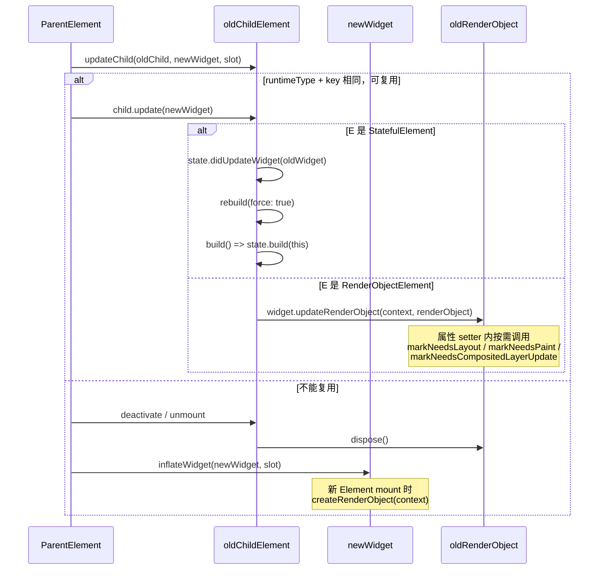

```dart
/// 这是从 Flutter `framework.dart` 中摘出来的学习片段，
/// 目的不是单独运行，而是专门用来理解 Element 复用和渲染链路。
///
/// Flutter 框架里最核心的“子节点更新入口”之一。
///
/// 可以把它理解成：
/// 1. 当前父 Element 已经拿到了这一次 build 产出的 newWidget
/// 2. 它现在要决定：旧的 child Element 能不能继续复用
/// 3. 如果能复用，就调用 child.update(newWidget)
/// 4. 如果不能复用，就销毁旧 child，再为 newWidget 创建新的 Element
///
/// 这也是 Flutter 复用机制的关键设计：
/// - 新的一侧传进来的是 Widget，因为 Widget 是“新的声明式配置”
/// - 旧的一侧传进来的是 Element，因为 Element 才是“运行时实例”
///
/// 注意：复用 Element != 一定不会重新渲染。
/// - 复用 Element 只是说明生命周期、位置、State、RenderObject 有机会继续保留
/// - 但如果配置变了，后续仍然可能触发 rebuild / relayout / repaint
///
/// 站在“当前父 Element”的视角：
/// - child: 这个槽位上旧的子 Element
/// - newWidget: 这次想放到这个槽位上的新 Widget
/// - newSlot: 子节点在父节点里的位置标记，比如列表里的索引/槽位
Element? updateChild(Element? child, Widget? newWidget, Object? newSlot) {
  // 情况 1：新的配置为空。
  // 这说明父节点这次 build 后，这个位置不再需要子节点了。
  // 所以如果旧 child 存在，就把它从树上摘掉并进入 deactivate 流程。
  if (newWidget == null) {
    if (child != null) {
      deactivateChild(child);
    }
    return null;
  }

  final Element newChild;
  if (child != null) {
    // hasSameSuperclass 是一个调试期保护。
    // 它主要用于避免热重载后“Stateless/Stateful 形态变化”导致旧 Element
    // 和新 Widget 类型体系不匹配，从而错误复用。
    bool hasSameSuperclass = true;

    assert(() {
      final int oldElementClass = Element._debugConcreteSubtype(child);
      final int newWidgetClass = Widget._debugConcreteSubtype(newWidget);
      hasSameSuperclass = oldElementClass == newWidgetClass;
      return true;
    }());


    if (hasSameSuperclass && child.widget == newWidget) {
        // 情况 2：child.widget == newWidget
        //
        // 这是最快路径：旧 Element 里保存的 widget 实例，和这次传进来的
        // newWidget 是“同一个对象”。
        //
        // 既然配置对象本身都没变，那就连 update 都不需要做；
        // 只需要在 slot 变动时修正位置信息，然后直接复用旧 child。
      if (child.slot != newSlot) {
        updateSlotForChild(child, newSlot);
      }
      newChild = child;


    } else if (hasSameSuperclass && Widget.canUpdate(child.widget, newWidget)) {
          // 情况 3：虽然不是同一个 Widget 实例，但仍然可以复用。
          //
          // Widget.canUpdate 的核心判断是：
          // - runtimeType 相同
          // - key 相同
          //
          // 满足这两个条件，框架就认为“旧 Element 还能服务这次新的配置”，
          // 因此不需要销毁旧 Element，而是让旧 Element 吃下新的 Widget。
      if (child.slot != newSlot) {
        updateSlotForChild(child, newSlot);
      }

      // 下面这段是性能分析打点。
      // profile/debug 下如果开启了构建追踪，会把这次 update 记录到时间线中，
      // 方便在 DevTools 里观察 rebuild 开销。
      final bool isTimelineTracked =
          !kReleaseMode && _isProfileBuildsEnabledFor(newWidget);
      if (isTimelineTracked) {
        Map<String, String>? debugTimelineArguments;
        assert(() {
          if (kDebugMode && debugEnhanceBuildTimelineArguments) {
            debugTimelineArguments =
                newWidget.toDiagnosticsNode().toTimelineArguments();
          }
          return true;
        }());
        FlutterTimeline.startSync('${newWidget.runtimeType}',
            arguments: debugTimelineArguments);
      }

      // 这里是“复用”的真正落点：
      // 不是创建新的 Element，而是让旧 child.update(newWidget)。
      //
      // 对于不同 Element 子类，update 内部会继续做自己的事：
      // - StatelessElement: 重新执行 build
      // - StatefulElement: 更新 widget 引用，必要时 didUpdateWidget，再决定 rebuild
      // - RenderObjectElement: 比较配置后更新底层 RenderObject
      //
      // 所以这里保住的不只是 Element 本身，
      // 往往还包括：
      // - BuildContext 身份
      // - StatefulWidget 对应的 State
      // - RenderObject
      //
      // 这正是 Flutter 高性能的关键：Widget 可以经常重建，
      // 但更“贵”的运行时对象尽量复用。
      child.update(newWidget);
      if (isTimelineTracked) {
        FlutterTimeline.finishSync();
      }
      assert(child.widget == newWidget);
      assert(() {
        child.owner!._debugElementWasRebuilt(child);
        return true;
      }());
      newChild = child;

    } else {

      // 情况 4：旧 child 无法复用。
      //
      // 常见原因：
      // - runtimeType 变了
      // - key 变了
      // - 调试期发现 Element/Widget 形态不匹配
      //
      // 这时只能把旧 child 退场，再为 newWidget 创建全新的 Element。
      deactivateChild(child);
      assert(child._parent == null);

      newChild = inflateWidget(newWidget, newSlot);
    }
  } else {
    // 情况 5：旧 child 本来就不存在。
    // 这是首次挂载的场景，直接根据 newWidget 创建新的 Element。
    newChild = inflateWidget(newWidget, newSlot);
  }

  // 下面这段也是调试期逻辑，主要是维护 GlobalKey 的占用关系。
  // GlobalKey 允许节点跨位置移动后仍保留原来的 State / Element 身份，
  // 所以框架需要记录“这个 key 当前归谁所有”。
  assert(() {
    if (child != null) {
      _debugRemoveGlobalKeyReservation(child);
    }
    final Key? key = newWidget.key;
    if (key is GlobalKey) {
      assert(owner != null);
      owner!._debugReserveGlobalKeyFor(this, newChild, key);
    }
    return true;
  }());

  // 返回最终留在这个槽位上的 Element。
  // 它可能是：
  // - 复用后的旧 child
  // - 也可能是为 newWidget 新创建的 Element
  return newChild;
}
```

flutter源码在/opt/fvm/versions/3.38.5/packages/flutter/lib/src/widgets/framework.dart ，


void update(StatefulWidget newWidget) ,

state.didUpdateWidget(oldWidget)  ,


rebuild(force: true);

,performRebuild,state.didChangeDependencies();

Widget build() => state.build(this);

1、statefullwidget中的state类中的这三个方法调用顺序： didUpdateWidget 和 didChangeDependencies ，build，需要结合复用来说

2、如果在didUpdateWidget或didChangeDependencies中继续调用setstate会怎么样
先给结论：

`didUpdateWidget` 本质上是“**复用了旧 State**，但是外面的 `widget` 配置变了”；
`didChangeDependencies` 本质上是“**这个 State 依赖的 InheritedWidget 变了**”；
`build` 则是把这次复用后的最新状态真正渲染出来。

结合你这版 Flutter 源码看，关键位置在：
[framework.dart](/opt/fvm/versions/3.38.5/packages/flutter/lib/src/widgets/framework.dart:5989) 的 `StatefulElement.update`、[framework.dart](/opt/fvm/versions/3.38.5/packages/flutter/lib/src/widgets/framework.dart:5980) 的 `performRebuild`、[framework.dart](/opt/fvm/versions/3.38.5/packages/flutter/lib/src/widgets/framework.dart:5934) 的 `build`。

**1. 这三个方法的调用顺序，结合“复用”怎么理解**

先记住复用前提：父节点更新子树时，如果新旧 widget 的 `runtimeType` 和 `key` 一样，Flutter 会**复用旧的 `StatefulElement` 和旧的 `State`**，不会新建 State。这个场景下才会走 `didUpdateWidget`。官方注释也写了这一点，在 [framework.dart](/opt/fvm/versions/3.38.5/packages/flutter/lib/src/widgets/framework.dart:1013)。

顺序要分场景看，不是永远固定一个序列。

1. 首次挂载，不是复用
顺序是：`initState -> didChangeDependencies -> build`
你可以直接看 [framework.dart](/opt/fvm/versions/3.38.5/packages/flutter/lib/src/widgets/framework.dart:5951)，`_firstBuild()` 里先调 `initState()`，再调 `state.didChangeDependencies()`，然后 `super._firstBuild()` 才进入真正的 build。

2. 父组件 rebuild，且当前 `StatefulWidget` 被复用
最常见顺序是：`didUpdateWidget -> build`
原因是 [framework.dart](/opt/fvm/versions/3.38.5/packages/flutter/lib/src/widgets/framework.dart:5989) 里：
- 先 `final oldWidget = state._widget!`
- 再把 `state._widget` 指向新的 widget
- 然后 `state.didUpdateWidget(oldWidget)`
- 最后 `rebuild(force: true)`

也就是说，`didUpdateWidget` 触发时：
- 这个 `State` 是旧的，说明它被复用了
- 但 `state.widget` 已经是新的 widget 了
- `oldWidget` 只是作为“旧配置快照”传进来给你对比

3. 依赖的 `InheritedWidget` 变了
顺序是：`didChangeDependencies -> build`
因为 [framework.dart](/opt/fvm/versions/3.38.5/packages/flutter/lib/src/widgets/framework.dart:5980) 的 `performRebuild()` 里会先判断 `_didChangeDependencies`，如果为 `true`，就先调 `state.didChangeDependencies()`，然后再走 `super.performRebuild()`，而后者内部会调用 `build()`。

4. 如果“父配置变了”和“依赖也变了”同时发生
顺序是：`didUpdateWidget -> didChangeDependencies -> build`
因为 `update()` 先执行 `didUpdateWidget`，然后 `rebuild(force: true)` 进入 `performRebuild()`，而 `performRebuild()` 里才会补调 `didChangeDependencies()`。

所以一个很适合面试的说法是：

- `didUpdateWidget` 是**复用旧 State 后，对新旧 widget 配置差异的响应**
- `didChangeDependencies` 是**对 InheritedWidget 依赖变化的响应**
- `build` 永远是最后把“这次复用后的最新配置 + 最新依赖 + 最新本地状态”渲染出来

再补一句很重要的边界：

如果这次**不能复用**，比如类型变了、`key` 变了，那么旧 State 会退场，新 State 会创建。
这时候不会走旧 State 的 `didUpdateWidget`，而是新 State 重新走 `initState -> didChangeDependencies -> build`。

**2. 如果在 `didUpdateWidget` 或 `didChangeDependencies` 里继续调 `setState` 会怎么样**

先说结论：**通常不会报错，但基本都是多余的，不推荐。**

1. 在 `didUpdateWidget` 里调用 `setState`

这是官方明确说“冗余”的。
你看 [framework.dart](/opt/fvm/versions/3.38.5/packages/flutter/lib/src/widgets/framework.dart:1024)：

`The framework always calls build after calling didUpdateWidget, which means any calls to setState in didUpdateWidget are redundant.`

也就是说：
- 你在 `didUpdateWidget` 里同步改字段，这次紧接着的 `build` 本来就会看到
- 再调一次 `setState`，只是又 `markNeedsBuild()` 一次
- 但 `update()` 后面本来就会 `rebuild(force: true)`，所以没有额外收益

实际效果通常是：
- 你的状态修改会生效
- 紧跟着的 build 也会看到它
- 但 `setState` 本身是多余的，增加了一点脏标记/调度噪音

所以在 `didUpdateWidget` 里，如果只是同步更新本地字段，通常直接赋值就够了，不必 `setState`。

2. 在 `didChangeDependencies` 里调用 `setState`

这个通常也没有必要。
原因有两层：

- 官方注释已经说了，依赖变化后框架会调用 `build`，见 [framework.dart](/opt/fvm/versions/3.38.5/packages/flutter/lib/src/widgets/framework.dart:1472)
- 实现上 `didChangeDependencies()` 就是在 `performRebuild()` 里、进入 `build()` 之前调用的，见 [framework.dart](/opt/fvm/versions/3.38.5/packages/flutter/lib/src/widgets/framework.dart:5980)

所以如果你在这里 `setState`：
- 当前 element 本来就处于这次 rebuild 流程里
- 这次 build 本来就马上会发生
- 你额外 `setState`，通常也不会带来更“新”的一次有效 build

更直白点说：
- `didUpdateWidget` 里的 `setState`：多余
- `didChangeDependencies` 里的 `setState`：通常也多余

**什么时候要小心**

如果你在这两个方法里做的是“会再次触发状态变化的副作用”，比如：
- 不加判断地发请求
- 请求回来又 `setState`
- 或者根据依赖变化不断改上游对象

那就容易造成频繁 rebuild，甚至看起来像“循环刷新”。
尤其是 `didChangeDependencies`，它本来就可能被调用多次，所以里面的副作用最好做好条件判断。

**面试版一句话答案**

- `didUpdateWidget` 只发生在 **State 被复用** 时，顺序上先于本次 `build`
- `didChangeDependencies` 发生在 **依赖的 InheritedWidget 变化** 时，也先于本次 `build`
- 如果两者同一轮都发生，顺序通常是：`didUpdateWidget -> didChangeDependencies -> build`
- 在这两个方法里调用 `setState` 一般都不会报错，但通常是**冗余**的，因为框架后面本来就会 `build`

如果你愿意，我下一条可以继续把这三者和一个具体例子串起来，比如用 `Theme.of(context)`、父组件改 `title`、子组件本地 `State` 三种变化各走哪条链路，我给你画成一张“调用时序图”。


1、StatefulElement

 void update(StatefulWidget newWidget)

state.didUpdateWidget(oldWidget)
 rebuild(force: true);


2、Element

void rebuild({bool force = false})
performRebuild();


3、StatefulElement

 void performRebuild()


state.didChangeDependencies();


4、


ComponentElement：

performRebuild();
    built = build();


5、StatefulElement

Widget build() => state.build(this);


所以顺序是：
state.didUpdateWidget(oldWidget)

state.didChangeDependencies();

state.build(this);


**面试答法**

1. 如何理解 Flutter 三棵树
   Flutter 有 `Widget`、`Element`、`RenderObject` 三棵树。`Widget` 是不可变配置，负责描述界面；`Element` 是运行时实例，负责承接 `BuildContext`、生命周期和复用；`RenderObject` 负责真正的布局、绘制和命中测试。面试里一句话可以说：`Widget` 负责“描述”，`Element` 负责“连接和复用”，`RenderObject` 负责“渲染落地”。

2. Flutter 渲染机制
   当状态变化时，先触发 `build` 生成新的 `Widget` 配置，再通过 `Element.updateChild` 判断哪些节点可复用，接着把变化同步到 `RenderObject`，然后进入渲染流水线：`layout -> paint -> compositing -> rasterization`。也就是说，Flutter 不是直接操作原生控件，而是自己维护渲染树并完成整套绘制流程。

3. Flutter 复用机制
   Flutter 复用的核心不是复用 `Widget`，而是复用 `Element`、`State`、`RenderObject`。判断是否能复用，关键看新旧 `Widget` 的 `runtimeType` 和 `key` 是否一致；一致就走 `Widget.canUpdate`，旧 `Element` 会执行 `update`，`StatefulWidget` 对应的 `State` 也会保留。类型变了或 `key` 变了，就会销毁旧节点并创建新节点。

4. Flutter 内存管理
   Flutter 主要依赖 Dart VM 的垃圾回收管理堆内存，但“可回收”不等于“不会泄漏”。真正要注意的是对象生命周期管理，比如 `AnimationController`、`ScrollController`、`TextEditingController`、`StreamSubscription`、`Timer`、监听器、图片缓存等，都要在合适时机 `dispose` 或取消订阅。面试里要强调：GC 解决的是“无人引用对象回收”，开发者仍要避免“长期持有引用导致的逻辑泄漏”。

5. 如何理解 Flutter 异步
   Flutter UI 默认跑在主 Isolate 上，`async/await` 本质是基于事件循环调度任务，不等于开启新线程。`Future` 适合一次性异步结果，`Stream` 适合持续数据流，`microtask` 优先级高于普通事件。UI 更新必须回到主 Isolate，耗时 CPU 任务要用 `Isolate` 或 `compute`，否则会阻塞渲染导致掉帧。

6. Flutter 内存优化
   重点是减少无意义对象、控制大对象生命周期、尤其是图片内存。常见做法包括：图片按显示尺寸解码，避免原图进内存；控制 `ImageCache` 和列表图片缓存；及时释放 controller、listener、订阅；长列表按需加载；避免把大集合、页面上下文、闭包引用长期挂在单例里。图片通常是 Flutter 内存优化里的最大头。

7. Flutter 性能优化
   性能优化主要看三块：减少不必要 `build`，减少不必要 `layout/paint`，避免主线程阻塞。常用手段有：`const`、拆小组件、局部刷新、合理使用 `ValueListenableBuilder/AnimatedBuilder`、长列表用 `ListView.builder`、复杂区域加 `RepaintBoundary`、图片缩略解码、异步计算放到 `Isolate`、避免在 `build` 里做重计算。面试最好强调一句：性能优化的本质是减少每一帧 16ms 内主线程需要做的工作量。

**一段总结版**

Flutter 的核心思路是：用 `Widget` 做声明式配置，用 `Element` 做生命周期和复用，用 `RenderObject` 做真正渲染；状态变化后通过复用机制尽量保留旧 `Element/State/RenderObject`，再进入布局和绘制流水线；性能和内存优化的重点则是减少重建、避免阻塞、控制图片和监听器生命周期。

如果你要，我可以下一条直接把这 7 题整理成一份“面试背诵稿”，每题控制在 30 秒到 1 分钟。


**面试背诵稿**

1. **如何理解 Flutter 三棵树**
Flutter 我会从三棵树来理解：`Widget` 树、`Element` 树、`RenderObject` 树。
`Widget` 是不可变配置，负责描述界面长什么样；
`Element` 是运行时实例，负责承接 `BuildContext`、生命周期和复用；
`RenderObject` 负责真正的布局、绘制和命中测试。

状态变化时，通常是先重新生成 `Widget`，
再由 `Element` 判断哪些节点可以复用，
最后把变化同步到 `RenderObject`。
所以三棵树本质上是“描述层、调度层、渲染层”的分工。

2. **Flutter 渲染机制**
Flutter 的渲染机制可以理解成一条流水线。

业务里调用 `setState` 后，并不是立刻重画，
而是先标记当前 `Element` 需要重建，等到下一帧统一处理。
处理时先执行 `build` 生成新的 `Widget` 配置，
再通过 `updateChild` 做复用判断，

然后把更新传给 `RenderObject`，之后进入 `layout`、`paint`、`compositing`，最后交给引擎栅格化显示到屏幕上。
更新完成后进入渲染流水线：布局、绘制、图层合成，最后再栅格化显示到屏幕上。

也就是说，Flutter 是自己维护渲染树，而不是频繁依赖原生控件树。

3. **Flutter 复用机制**
Flutter 复用的核心不是复用 `Widget`，因为 `Widget` 本来就是轻量、不可变、可以频繁新建的。
真正复用的是 `Element`、`State` 和 `RenderObject`。
判断能不能复用，关键看新旧 `Widget` 的 `runtimeType` 和 `key` 是否一致；
一致就会走 `Widget.canUpdate`，旧 `Element` 调用 `update`，对应的 `State` 也会保留下来。如果类型变了或者 `key` 变了，就会销毁旧节点、创建新节点。

面试里一句话可以总结：
Flutter 是拿“新的 Widget 配置”去驱动“旧的 Element 实例”是否继续复用。

4. **Flutter 内存管理**
Flutter 的内存管理底层依赖 Dart VM 的垃圾回收，也就是 GC 自动回收没有引用的对象。
但在业务层，开发者仍然要管理对象生命周期，因为很多问题不是 GC 失效，而是对象一直被引用着。
比如 `AnimationController`、`ScrollController`、`TextEditingController`、`StreamSubscription`、`Timer`、监听器这些，
都要在 `dispose` 里及时释放。
还有图片缓存、页面闭包、单例持有 `context` 等，也容易造成逻辑上的内存泄漏。

所以我会把 Flutter 内存管理分成两层：底层靠 GC，业务层靠生命周期约束。

5. **如何理解 Flutter 异步**
Flutter 默认跑在主 `Isolate` 上，`async/await` 本质是基于事件循环的异步调度，不等于开了新线程。
`Future` 适合一次性结果，`Stream` 适合持续数据流，`microtask` 的优先级比普通事件更高。
对于网络请求、IO 这类任务，用 `Future` 就够；

但如果是 JSON 大解析、图片处理、加密这类 CPU 密集型任务，就应该放到 `Isolate` 或 `compute`，否则会阻塞主线程导致掉帧。
面试里可以强调：Flutter 的异步重点不是“会不会写 await”，而是“能不能避免卡住 UI”。

6. **Flutter 内存优化**
Flutter 内存优化我会优先盯三类对象：图片、大集合、长期存活对象。
图片最容易出问题，因为磁盘图片小，不代表解码后占内存小，所以要按展示尺寸解码，比如控制 `cacheWidth/cacheHeight` 或使用缩略图；
列表数据不要一次性全量持有，大页面要按需加载；各种 controller、subscription、listener 用完及时释放。
还有一个常见点是不要把页面级对象长期挂在单例里，尤其不要错误持有 `BuildContext`。

总结就是：减少大对象、缩短生命周期、控制图片解码尺寸。

7. **Flutter 性能优化**
Flutter 性能优化我通常从 `build`、`layout`、`paint` 三个阶段看。

第一，减少不必要的重建，比如多用 `const`、拆小组件、局部刷新、避免整页 `setState`；
第二，减少不必要的布局和重绘，比如复杂区域加 `RepaintBoundary`，长列表用 `ListView.builder`；
第三，避免主线程阻塞，比如不要在 `build` 里做重计算，耗时任务放到 `Isolate`。
图片也是性能优化重点，要用合适分辨率、缓存策略和懒加载。

面试里我会收束成一句：性能优化的本质是减少每一帧 16ms 内主线程要做的工作量。

**通用收尾句**
如果让我把这 7 个点串起来，我会说：
Flutter 通过三棵树解耦描述、复用和渲染；
通过 `Element` 复用降低重建成本；
通过异步和生命周期管理控制卡顿与泄漏；
最终目标就是让 UI 在有限帧预算内稳定完成构建、布局和绘制。

如果你要，我可以继续把这份背诵稿压缩成“每题 3 句版”，更适合现场快答。


下面这 3 题，我给你整理成**面试可直接口述版**。你可以按“先总后分”的方式答，既显得有体系，也容易展开。

**1. 讲一下手指触摸屏幕，iOS 都做了哪些流程，比如 RunLoop 相关的**

我会把 iOS 的触摸流程分成 6 步来讲。

1. **硬件采样与系统事件生成**
手指触摸屏幕后，触摸屏控制器先采样坐标和状态，内核把它转换成底层输入事件，经过系统服务转交给前台 App。

2. **事件进入主线程 RunLoop**
这些触摸事件最终会通过端口消息的形式，进入主线程 RunLoop 的事件源里。主线程 RunLoop 被唤醒后，会开始处理这次触摸事件。
面试里可以强调一句：**UI 事件、定时器、屏幕刷新，本质上都是 RunLoop 在驱动。**

3. **UIApplication 分发事件**
RunLoop 把事件交给 `UIApplication`，然后由它调用 `sendEvent:` 分发给当前窗口。

4. **UIWindow 做命中测试**
`UIWindow` 会从根视图开始做 `hitTest:withEvent:`，沿着视图树找到最合适的目标 View，也就是这次触摸真正要交给谁处理。

5. **Responder Chain 与手势识别**
找到目标 View 后，系统会把 `touchesBegan / Moved / Ended` 这些事件沿响应链分发。
同时，挂在 View 上的 `UIGestureRecognizer` 也会参与识别，比如点击、长按、滑动、拖拽等。

6. **如果界面需要更新，再进入渲染流程**
如果事件处理过程中改了状态，比如改了 frame、文本、颜色，系统会标记界面需要刷新。等到下一次屏幕刷新信号到来时，RunLoop 会配合 `CADisplayLink`、Core Animation，把布局和绘制结果提交到渲染流水线，最后显示到屏幕上。

**一句话总结**
iOS 触摸流程本质上是：**硬件触摸 -> RunLoop 收到事件 -> UIApplication 分发 -> hitTest 找目标 -> 响应链/手势识别处理 -> 如有需要再触发界面刷新。**

---

**2. Flutter 呢，当手指触摸屏幕，都做了哪些事**

Flutter 的触摸流程，本质上是“**先走宿主平台事件分发，再走 Flutter 自己的手势系统和渲染系统**”。

1. **iOS/Android 先收到原生触摸事件**
触摸屏幕后，底层系统还是先产生原生事件。
也就是说，Flutter 不是绕开系统输入机制，它只是**不依赖原生控件树渲染 UI**，但输入事件仍然先经过宿主平台。

2. **事件进入 Flutter Engine**
原生层把触摸事件交给 Flutter Engine。Engine 会把原生触摸数据转换成 Flutter 能理解的 `PointerData`。

3. **事件发送到 Dart UI Isolate**
Engine 把这些指针数据发给 Dart 层，进入 Flutter Framework。

4. **Flutter 先做命中测试，再分发 Pointer 事件**
Framework 会先做 hit test，确认这次触摸命中了 Render Tree 上哪些对象，然后分发 `PointerDown / Move / Up` 等事件。

5. **进入 Gesture Arena 手势竞技场**
Flutter 不会立刻认定是点击还是滑动，而是让多个手势识别器一起竞争。
比如一个列表项里既可能有 `TapGestureRecognizer`，也可能有 `VerticalDragGestureRecognizer`，最后谁赢由手势竞技场裁决。

6. **业务回调触发**
如果点击手势胜出，就会触发 `onTap`；如果拖拽胜出，就会触发 `onVerticalDragUpdate` 之类的回调。

7. **如果状态变化，触发 Flutter 渲染流水线**
如果回调里调用了 `setState`，Flutter 会先标记对应 Element dirty，在下一帧重新执行：
- build
- 复用 Element
- 更新 RenderObject
- 布局
- 绘制
- 图层合成
- 交给 Engine 栅格化显示

**一句话总结**
Flutter 触摸流程是：**原生系统收事件 -> Engine 转成 Pointer 数据 -> Framework 做命中测试和手势竞技 -> 业务回调执行 -> 如有状态变化再进入 Flutter 自己的渲染流水线。**

**面试时很加分的一句**
iOS/Android 负责“把触摸送进来”，Flutter 负责“在自己的渲染树里解释这次触摸，并决定如何更新界面”。

---

**3. App 冷启动的全过程是什么**

冷启动的关键点是：**进程原本不存在，从 0 到首帧展示出来**。

我建议你按下面这个顺序答。

1. **用户点击图标，请求启动 App**
系统发现目标 App 进程不存在，所以这是冷启动，不是热启动或前后台切换。

2. **系统创建进程并加载可执行文件**
操作系统会创建进程，加载 App 的 Mach-O 文件，`dyld` 开始做动态库加载、符号绑定、重定位。

3. **Runtime 初始化**
包括 Objective-C Runtime 注册类、分类、协议，执行静态初始化代码等。

4. **进入 main 函数**
之后进入 `main`，再调用 `UIApplicationMain`，正式把应用交给 UIKit 生命周期管理。

5. **创建 Application、Delegate、Scene、Window**
系统会创建 `UIApplication`、`AppDelegate`，如果是多场景架构还会走 `SceneDelegate`，再创建 `UIWindow` 和根视图控制器。

6. **业务初始化**
这一步通常是我们自己代码里最容易拖慢启动的部分，比如：
- 日志系统初始化
- 网络层初始化
- 数据库打开
- 配置加载
- 路由准备
- 第三方 SDK 初始化

7. **首屏 View 构建与渲染**
UIKit 或 Flutter 首屏开始构建界面，经过布局、绘制、合成，最终首帧显示到屏幕上。
当用户第一次看到界面，这次冷启动才算真正完成。

---

**如果是 Flutter App 冷启动，可以再多补一句**

Flutter 冷启动除了上面的原生流程，还多了一层 Flutter 自己的启动过程：

1. 原生进程启动
2. FlutterEngine 创建
3. Dart VM / Isolate 初始化
4. 加载 AOT snapshot / 资源
5. 执行 Dart `main()`
6. `runApp()`
7. 构建 Widget 树、Element 树、RenderObject 树
8. 生成首帧并显示

**一句话总结**
冷启动就是：**系统创建进程 -> 完成动态库和运行时初始化 -> 进入应用生命周期 -> 初始化业务和 UI -> 渲染首帧展示。**

---

**面试收尾版**

你可以最后统一收束成这三句：

- iOS 触摸事件的核心是 **RunLoop 驱动事件分发和界面刷新**。
- Flutter 触摸事件的核心是 **宿主平台送入事件，Flutter 自己完成命中测试、手势竞争和渲染更新**。
- 冷启动的核心是 **从无进程到首帧可见，中间包括系统启动、运行时初始化、业务初始化和首屏渲染**。

如果你要，我下一条可以继续把这 3 题压成“每题 20 秒短答版”，更适合现场快问快答。


**20 秒短答版**

1. **iOS 手指触摸屏幕流程**
手指触摸后，硬件先采样，系统生成触摸事件并唤醒主线程 `RunLoop`。`UIApplication` 接收事件，`UIWindow` 通过命中测试找到目标 View，再沿响应链和手势系统分发处理；如果状态变化，下一次屏幕刷新时再触发布局和绘制。

2. **Flutter 手指触摸屏幕流程**
触摸事件先由 iOS/Android 原生系统接收，再交给 Flutter Engine 转成 `Pointer` 事件发到 Dart 层。Flutter Framework 先做命中测试，再进入手势竞技场决定是点击还是滑动；如果业务里触发 `setState`，下一帧再走 build、复用、布局、绘制和图层合成。

3. **App 冷启动全过程**
冷启动就是 App 进程原本不存在，系统先创建进程，加载可执行文件和动态库，完成 Runtime 初始化，然后进入 `main` 和应用生命周期，接着做业务初始化、构建首屏界面，最后完成首帧渲染并显示到屏幕上。

如果你愿意，我还能继续给你压成“每题 3 句极简版”，适合面试官连续快问时直接背。


1. **iOS 触摸流程**
手指触摸后，系统先生成触摸事件并唤醒主线程 `RunLoop`。`UIApplication` 和 `UIWindow` 完成事件分发与命中测试。目标 View 经响应链或手势识别处理，必要时再触发界面刷新。

2. **Flutter 触摸流程**
触摸事件先由原生系统接收，再交给 Flutter Engine 转成指针事件。Framework 做命中测试和手势竞技，决定触发哪个回调。若状态变化，下一帧再走构建、复用、布局、绘制和图层合成。

3. **App 冷启动**
冷启动是从“没有进程”到“首帧可见”的全过程。系统先创建进程并完成动态库、Runtime 和应用生命周期初始化。随后业务初始化、首屏构建、首帧渲染，用户最终看到页面。


可以，这块你已经走到 Flutter 复用机制最核心的一层了。

先给结论：

**`RenderObject` 的复用不是单独判定的，它是“跟着 RenderObjectElement 一起复用”的。**
也就是说，先由 `updateChild` 决定 **旧 Element 能不能复用**；如果复用成功，而且这个旧 Element 恰好是 `RenderObjectElement`，那它里面持有的 **同一个 RenderObject 实例** 就会被继续使用，只是把新配置同步进去。

**1. RenderObject 复用的总流程**

你可以把它记成这 4 步：

1. 父节点调用 `updateChild(oldChild, newWidget, slot)`
2. 如果 `runtimeType + key` 一致，旧 `Element` 复用
3. 如果这个旧 `Element` 是 `RenderObjectElement`，就不会新建 `RenderObject`
4. 而是调用 `widget.updateRenderObject(context, renderObject)`，把新配置写进旧 `RenderObject`

所以：

- `Element` 决定“能不能继续活着”
- `RenderObject` 决定“活着之后怎么更新自己”

---

**2. 关键源码你直接看这几段**

`RenderObjectWidget` 规定了两个关键入口，在 [framework.dart](/opt/fvm/versions/3.38.5/packages/flutter/lib/src/widgets/framework.dart:1891)：

- `createRenderObject(BuildContext context)`
- `updateRenderObject(BuildContext context, RenderObject renderObject)`

意思非常明确：

- 第一次创建时，走 `createRenderObject`
- 后续复用时，走 `updateRenderObject`

真正落到 `RenderObjectElement` 上，在 [framework.dart](/opt/fvm/versions/3.38.5/packages/flutter/lib/src/widgets/framework.dart:6787) 和 [framework.dart](/opt/fvm/versions/3.38.5/packages/flutter/lib/src/widgets/framework.dart:6809)：

- `mount()` 里：
  ```dart
  _renderObject = (widget as RenderObjectWidget).createRenderObject(this);
  ```
  这表示 **首次挂载时才创建 RenderObject**

- `update()` 里：
  ```dart
  _performRebuild(); // calls widget.updateRenderObject()
  ```

- `_performRebuild()` 里：
  ```dart
  (widget as RenderObjectWidget).updateRenderObject(this, renderObject);
  ```
  这里传进去的 `renderObject`，就是**原来的那个实例**，不是新的

所以这就是 RenderObject 复用的铁证：

**第一次 mount 创建一次；以后只 update，不重建。**

---

**3. 为什么说 RenderObject 是“跟着 Element 复用”的**

因为 `RenderObject` 自己并不会先拿出来和“新 RenderObject”做比较。
实际上根本不会先创建一个“新 RenderObject”再比。

流程是这样的：

- `updateChild` 先判断旧 `Element` 能不能复用
- 如果不能复用：
  - 旧 `RenderObjectElement` 会 `unmount`
  - 对应的 `RenderObject` 会被 `dispose`
  - 新 widget 再重新 `mount`，重新 `createRenderObject`

这个销毁逻辑你看 [framework.dart](/opt/fvm/versions/3.38.5/packages/flutter/lib/src/widgets/framework.dart:6861)：
```dart
oldWidget.didUnmountRenderObject(renderObject);
_renderObject!.dispose();
_renderObject = null;
```

所以一句话：

**RenderObject 不单独做复用判定，RenderObject 的生死跟它所属的 RenderObjectElement 绑定。**

---

**4. 复用后，RenderObject 到底更新了什么**

这里最关键的一点是：

**`updateRenderObject` 只是把“新 widget 配置”同步给“旧 renderObject”**，
真正决定是否重新布局、重绘、更新图层的，是 `RenderObject` 自己属性 setter 里的脏标记逻辑。

看一个最典型例子：`Opacity`

`Opacity` widget 在 [basic.dart](/opt/fvm/versions/3.38.5/packages/flutter/lib/src/widgets/basic.dart:367)：
```dart
void updateRenderObject(BuildContext context, RenderOpacity renderObject) {
  renderObject
    ..opacity = opacity
    ..alwaysIncludeSemantics = alwaysIncludeSemantics;
}
```

注意，这里没有新建 `RenderOpacity`，只是给旧对象重新赋值。

而 `RenderOpacity.opacity` 的 setter 在 [proxy_box.dart](/opt/fvm/versions/3.38.5/packages/flutter/lib/src/rendering/proxy_box.dart:898)：

```dart
set opacity(double value) {
  if (_opacity == value) {
    return;
  }
  ...
  markNeedsCompositingBitsUpdate();
  markNeedsCompositedLayerUpdate();
  ...
}
```

这说明：

- 如果值没变，直接 return，连后续渲染更新都不会做
- 如果值变了，也不是重建 RenderObject
- 而是对**同一个 RenderObject** 打脏标记，让它在后续帧里更新合成层/语义等

这就是 RenderObject 复用的真正价值：

**对象不换，只改属性；改完后由 RenderObject 自己决定需要重新布局、重绘还是更新图层。**

---

**5. 子 RenderObject 是怎么跟着复用的**

这块很容易忽略，但特别重要。

如果是 `SingleChildRenderObjectElement`，它在 update 时除了更新自己的 renderObject，还会继续更新 child，在 [framework.dart](/opt/fvm/versions/3.38.5/packages/flutter/lib/src/widgets/framework.dart:7138) 附近：

```dart
_child = updateChild(_child, (widget as SingleChildRenderObjectWidget).child, null);
```

意思是：

- 父 renderObject 先复用自己
- 然后对子节点继续走 `updateChild`
- 如果子 element 也复用，子 renderObject 也会继续复用

如果是多孩子节点，比如 `Row`、`Column` 这种 `MultiChildRenderObjectElement`，会走 `updateChildren(...)`，在 [framework.dart](/opt/fvm/versions/3.38.5/packages/flutter/lib/src/widgets/framework.dart:7218) 附近。

当孩子位置变化时，不一定销毁 child renderObject，而是移动它。关键方法在 [framework.dart](/opt/fvm/versions/3.38.5/packages/flutter/lib/src/widgets/framework.dart:6915) 和 [framework.dart](/opt/fvm/versions/3.38.5/packages/flutter/lib/src/widgets/framework.dart:7090) 附近：

- `moveRenderObjectChild(...)`
- `insertRenderObjectChild(...)`
- `removeRenderObjectChild(...)`

也就是说：

**多子节点场景下，RenderObject 不只是“复用或销毁”，还可能是“复用并移动位置”。**

---

**6. 再压成一句面试话术**

你可以直接这么答：

**Flutter 里 RenderObject 的复用不是单独判断的，而是建立在 Element 复用成功的前提上。首次挂载时 `RenderObjectElement.mount` 调 `createRenderObject` 创建 RenderObject，后续同类型同 key 复用时，只会在 `RenderObjectElement.update` 里调用 `updateRenderObject` 把新配置同步到旧 RenderObject；真正决定要不要重新布局或重绘，是 RenderObject 自己在属性 setter 里调用 `markNeedsLayout`、`markNeedsPaint` 等脏标记方法。**

如果你愿意，我下一条可以继续把这条链画成一张“`Widget -> Element -> RenderObject` 复用时序图”，或者直接把这部分中文注释补进 [t.dart](/Users/huchu/Desktop/test-flutter-mix/flutter_study/lib/t.dart:1)。

---

## Widget -> Element -> RenderObject 复用时序图

先记一句总纲：

**Widget 是这次的新配置，Element 是复用判定层，RenderObject 是真正被尽量复用的渲染实体。**

也就是说：

- 框架不会先创建一个“新的 RenderObject”再和旧的比
- 先由 `updateChild` 判断旧 `Element` 能不能复用
- 只有 `Element` 复用成功，里面的旧 `RenderObject` 才会继续活着
- 然后通过 `updateRenderObject` 把新配置同步到旧 `RenderObject`

### 1. 复用总时序图



### 2. 这张图最关键的 5 个结论

1. `Widget` 不负责复用，它只是“这次想要的最新配置”。
2. `Element` 才是复用判定层，`updateChild` 先决定旧节点能不能继续活着。
3. `RenderObject` 不单独做“新旧对比”，它的生死跟 `RenderObjectElement` 绑定。
4. 首次挂载走 `createRenderObject`，后续复用走 `updateRenderObject`。
5. `updateRenderObject` 不是重建渲染对象，而是把新配置写进旧对象，再由旧对象自己决定是否重新布局、重绘或更新图层。

### 3. 首次挂载 vs 后续复用

可以把 `RenderObject` 生命周期分成两段：

#### 首次挂载

`RenderObjectElement.mount()` 中会创建渲染对象：

```dart
_renderObject = (widget as RenderObjectWidget).createRenderObject(this);
```

这说明：

- 第一次进入渲染树时，才真正 new 一个 `RenderObject`
- 此后这个 `RenderObject` 会挂在当前 `RenderObjectElement` 身上

#### 后续复用

`RenderObjectElement.update()` 不会重新创建，而是走：

```dart
(widget as RenderObjectWidget).updateRenderObject(this, renderObject);
```

注意这里传进去的 `renderObject` 就是**旧实例本身**。

所以可以直接记成一句：

**`createRenderObject` 只负责出生，`updateRenderObject` 负责复用后的配置同步。**

### 4. RenderObject 复用后到底更新什么

这里最容易误解的一点是：

**复用 RenderObject，不等于一定会重新布局，也不等于一定会重新绘制。**

真正的判断发生在 `RenderObject` 自己的属性 setter 里。

以 `Opacity` 为例：

```dart
void updateRenderObject(BuildContext context, RenderOpacity renderObject) {
  renderObject
    ..opacity = opacity
    ..alwaysIncludeSemantics = alwaysIncludeSemantics;
}
```

这里看上去只是赋值，但真正的渲染决策藏在 `RenderOpacity.opacity` 的 setter 里：

- 如果新旧值一样，直接返回，什么都不做
- 如果值变了，可能调用：
  - `markNeedsLayout()`
  - `markNeedsPaint()`
  - `markNeedsCompositingBitsUpdate()`
  - `markNeedsCompositedLayerUpdate()`

所以真正准确的说法是：

**Widget 只负责把“新配置”喂给 RenderObject；RenderObject 自己判断这次变化会影响布局、绘制还是图层。**

### 5. 单子节点和多子节点的 RenderObject 复用

`RenderObject` 不只是“保住自己”，它和子节点之间的父子关系也要一起维护。

#### 单子节点

`SingleChildRenderObjectElement.update()` 里会继续：

```dart
_child = updateChild(_child, (widget as SingleChildRenderObjectWidget).child, null);
```

意思是：

- 先更新当前节点自己的 `RenderObject`
- 再递归决定 child 的 `Element` 能不能复用
- 如果 child 也复用，child 对应的 `RenderObject` 也会继续复用

#### 多子节点

`MultiChildRenderObjectElement.update()` 里会走 `updateChildren(...)`。

这时孩子不只是“复用或销毁”两种结果，还可能有第三种情况：

- **复用并移动位置**

所以多子节点场景还会用到：

- `insertRenderObjectChild(...)`
- `moveRenderObjectChild(...)`
- `removeRenderObjectChild(...)`

这说明：

**多子节点容器里，RenderObject 的 child 链接关系也是动态维护的，不是每次整个重建。**

### 6. 把整条链压成一段面试话术

你可以直接这么说：

**Flutter 里 RenderObject 的复用不是单独判断的，而是建立在 Element 复用成功的前提上。父节点先通过 `updateChild` 根据新旧 Widget 的类型和 key 判断旧 Element 能不能复用；如果复用成功，而且这个 Element 是 `RenderObjectElement`，那么它不会重新创建 RenderObject，而是调用 `updateRenderObject` 把新配置同步到旧 RenderObject。真正决定要不要重新布局、重绘或更新图层的是 RenderObject 自己的属性 setter，它会按需调用 `markNeedsLayout`、`markNeedsPaint` 等脏标记方法。`**

### 7. 一眼记忆版

- `Widget`：新的配置
- `Element`：决定复不复用
- `State`：复用后保留本地状态
- `RenderObject`：复用后的渲染实体
- `createRenderObject`：首次创建
- `updateRenderObject`：复用后同步配置
- `markNeedsLayout / markNeedsPaint`：决定后续渲染成本

### 8. 你可以怎么对着源码看

建议你按这个顺序对着 Flutter 源码走一遍：

1. 先看 `updateChild`
2. 再看 `StatefulElement.update`
3. 再看 `RenderObjectElement.mount / update / _performRebuild`
4. 再挑一个具体组件，比如 `Opacity`、`Padding`、`Align`、`Text`
5. 最后看对应 `RenderObject` 的属性 setter 里到底调用了什么脏标记方法

这样你会非常清楚：

- `Element` 是怎么复用的
- `State` 是什么时候保住的
- `RenderObject` 是什么时候不重建、只更新属性的
- 为什么有些变化只重绘，有些变化会重新布局


可以把 `slot` 理解成：

**父 Element 给每个子 Element 发的“位置凭证”**，用来说明“你现在在我这里应该挂在哪个位置”。

它**不是业务里的数据索引**，也不是你平时写代码时直接操作的东西，而是 Flutter 框架内部维护子节点顺序和 RenderObject 插入位置的标记。

关键源码说明在这里：
- [updateChild 注释](/opt/fvm/versions/3.38.5/packages/flutter/lib/src/widgets/framework.dart:3942)
- [slot 的语义由父 Element 决定](/opt/fvm/versions/3.38.5/packages/flutter/lib/src/widgets/framework.dart:6964)
- [单子节点时 slot 永远是 null](/opt/fvm/versions/3.38.5/packages/flutter/lib/src/widgets/framework.dart:7116)
- [多子节点时用 IndexedSlot](/opt/fvm/versions/3.38.5/packages/flutter/lib/src/widgets/framework.dart:4091)
- [MultiChildRenderObjectElement 用 slot 决定插入到谁后面](/opt/fvm/versions/3.38.5/packages/flutter/lib/src/widgets/framework.dart:7194)

**先看你最容易混的点**

你看到这段：

```dart
if (child.slot != newSlot) {
  updateSlotForChild(child, newSlot);
}
```

意思不是“child 的业务数据变了”，而是：

**这个旧 child 虽然还能复用，但它在父节点孩子列表里的位置标记变了，所以要把它的 slot 更新一下。**

也就是：

- `child.slot`：上一次 build 时，这个 child 在父节点里的旧位置标记
- `newSlot`：这一次 build 后，这个 child 应该处于的新位置标记

如果两者不同，说明：

**child 本人可以复用，但它在父节点里的挂载位置变了。**

---

**slot 到底长什么样，要看父节点类型**

1. 如果父节点只有一个 child  
比如 `Container(child: Text(...))` 这种，slot 通常就是 `null`。  
源码里 `SingleChildRenderObjectElement` 调 `updateChild(..., null)`，见 [framework.dart](/opt/fvm/versions/3.38.5/packages/flutter/lib/src/widgets/framework.dart:7118)。

所以你那个：

```dart
class SSWidget extends StatelessWidget {
  @override
  Widget build(BuildContext context) {
    return Container();
  }
}
```

这里 `SSWidget` 自己 build 出来的 `Container`，对于它的父 `Element` 来说，通常就是**单子节点场景**，slot 没什么特别的，基本就是 `null`。

2. 如果父节点有多个 children  
比如 `Row(children: [...])`、`Column(children: [...])`、`Stack(children: [...])`，这时 slot 就不是 `null` 了。

Flutter 默认会给它一个 `IndexedSlot(index, previousChild)`，源码在 [framework.dart](/opt/fvm/versions/3.38.5/packages/flutter/lib/src/widgets/framework.dart:4137)。

它包含两层信息：

- `index`：这个 child 在新的 children 列表里排第几个
- `value`：它前一个兄弟节点是谁

---

**你问的“列表里的索引”到底指什么**

指的是：

**这个 child 在父 widget 的 children 列表里的位置。**

比如：

```dart
Row(
  children: [
    A(), // index 0
    B(), // index 1
    C(), // index 2
  ],
)
```

那这三个 child 的 slot，大致就是：

- `A -> IndexedSlot(0, null)`
- `B -> IndexedSlot(1, A对应的Element)`
- `C -> IndexedSlot(2, B对应的Element)`

这里的“索引”不是业务数据 `id`，而是 **children 数组里的位置编号**。

---

**为什么只靠“前一个兄弟”还不够，还要加 index**

这是 Flutter 这里设计得很巧的地方。

源码自己举了一个例子，在 [framework.dart](/opt/fvm/versions/3.38.5/packages/flutter/lib/src/widgets/framework.dart:4110)：

旧顺序：

```dart
[e1, e2, e3, e4]
```

新顺序：

```dart
[e1, e3, e4, e2]
```

注意 `e4`：

- 旧时它前一个兄弟是 `e3`
- 新时它前一个兄弟还是 `e3`

如果 slot 里只记录“前一个兄弟是谁”，那 `e4` 看起来好像没动。  
但实际上它的**列表索引变了**，RenderObject 在父节点 child 链表里的真实顺序也需要移动。

所以 Flutter 用 `IndexedSlot(index, previousSibling)`：

- `previousSibling` 帮父 RenderObject 知道插到谁后面
- `index` 保证只要位置序号变了，slot 就会变，从而触发移动

这就是为什么 `slot` 不是简单的一个整数，也不是简单的前驱指针，而是两者组合。

---

**updateSlotForChild 干了什么**

它的本质是：

**更新 child 的位置标记，并在需要时让对应的 RenderObject 也挪位置。**

尤其对 `RenderObjectElement` 来说，slot 更新后可能会进一步触发：

- `moveRenderObjectChild(...)`

你可以看这里：
- [RenderObjectElement.updateSlot](/opt/fvm/versions/3.38.5/packages/flutter/lib/src/widgets/framework.dart:6908)
- [MultiChildRenderObjectElement.moveRenderObjectChild](/opt/fvm/versions/3.38.5/packages/flutter/lib/src/widgets/framework.dart:7202)

所以 `slot` 不是纯记录字段，它会影响：

**RenderObject 在父 RenderObject 子链表中的挂载位置。**

---

**一句话彻底记住**

**slot 就是父 Element 给子 Element 的“挂载位置说明书”；单子节点通常是 null，多子节点通常是 IndexedSlot(index, previousSibling)。**

---

**你可以这样理解那行代码**

```dart
if (child.slot != newSlot) {
  updateSlotForChild(child, newSlot);
}
```

翻译成人话就是：

**这个旧 child 我还要继续用，但它这次在父节点孩子列表里的位置说明变了，所以我要把它的位置记录更新掉，必要时顺便把它对应的 RenderObject 也挪到正确位置。**

如果你愿意，我下一条可以继续直接给你画一张 `Row(children: [A, B, C]) -> Row(children: [A, C, B])` 的 slot 变化图。


判断标准不是“Element 复用了，所以该写哪”，而是：

**你这段逻辑到底是在响应“widget 参数变化”，还是在响应“Inherited 依赖变化”。**

可以直接这么分：

- **写在 `didUpdateWidget`**
  适合处理：父组件传进来的 `widget.xxx` 变了  
  比如：
    - `widget.id`
    - `widget.url`
    - `widget.controller`
    - `widget.onChanged`
    - 需要拿 `oldWidget` 和新 `widget` 对比

- **写在 `didChangeDependencies`**
  适合处理：你依赖的 `context` 环境变了  
  比如：
    - `Theme.of(context)`
    - `MediaQuery.of(context)`
    - `Localizations.of(context)`
    - `Provider.of<T>(context)` / `context.watch<T>()`
    - 任何 `InheritedWidget` 变化

**一句话记忆**

- `didUpdateWidget`：响应**外部传参变化**
- `didChangeDependencies`：响应**上下文依赖变化**

---

**怎么选最稳**

如果你的逻辑需要比较新旧参数，用 `didUpdateWidget`，因为它有 `oldWidget`。

如果你的逻辑依赖 `context` 里的 inherited 数据，用 `didChangeDependencies`，因为它就是为这个场景准备的，而且首次挂载后也会先调一次它。

---

**典型例子**

适合放 `didUpdateWidget`：

```dart
@override
void didUpdateWidget(covariant MyPage oldWidget) {
  super.didUpdateWidget(oldWidget);
  if (oldWidget.userId != widget.userId) {
    _reloadByUserId(widget.userId);
  }
}
```

这里明显是在响应 `widget.userId` 变化。

适合放 `didChangeDependencies`：

```dart
Locale? _lastLocale;

@override
void didChangeDependencies() {
  super.didChangeDependencies();
  final locale = Localizations.localeOf(context);
  if (_lastLocale != locale) {
    _lastLocale = locale;
    _reloadByLocale(locale);
  }
}
```

这里是在响应 `context` 里的语言环境变化。

---

**如果两者都影响这段逻辑怎么办**

那就拆成一个公共方法，在两个生命周期里都调，但要加判断，避免重复执行。

比如：

```dart
void _refreshIfNeeded() {
  // 根据 widget 参数 + inherited 依赖综合判断
}
```

然后：

- `didUpdateWidget` 里调一次
- `didChangeDependencies` 里调一次
- 内部自己判断是否真的需要刷新

因为当两者同一轮都发生时，顺序通常是：

**`didUpdateWidget -> didChangeDependencies -> build`**

所以如果你不加判断，可能会做两遍同样的事。

---

**实战建议**

- 不要把 `didChangeDependencies` 当成“万能更新入口”，它可能比你想象中更频繁。
- 不要把依赖 `Theme/MediaQuery/Provider` 的逻辑塞进 `didUpdateWidget`，因为它不一定会在 inherited 变化时触发。
- 如果只是同步改几个本地字段，通常不需要在这两个方法里再 `setState`，因为后面本来就会 `build`。

---

**面试答法**

**如果逻辑是在响应父组件传入的配置变化，我会写在 `didUpdateWidget`；如果逻辑是在响应 `Theme`、`MediaQuery`、`Provider` 这类 `InheritedWidget` 依赖变化，我会写在 `didChangeDependencies`。前者看“参数变没变”，后者看“上下文环境变没变”。如果两者都会影响结果，我会抽一个公共方法并加条件判断，避免重复执行。**

如果你愿意，我下一条可以继续帮你整理一份：**哪些逻辑该放 `initState` / `didUpdateWidget` / `didChangeDependencies` / `build` 的对照表**。


看这张图最直观，`Stack` 里**后面的 child 会后画，所以会在上层**。

```mermaid
flowchart TB
    subgraph S1["旧状态：Stack(children: [A, B])"]
        W1["Widget 顺序：A -> B"]
        E1["Element 顺序：EA -> EB"]
        R1["RenderObject 顺序：RA -> RB"]
        P1["绘制结果：A 先画，B 后画，B 在上层"]
        W1 --> E1 --> R1 --> P1
    end

    subgraph S2["新状态（正确同步）：Stack(children: [B, A])"]
        W2["Widget 顺序：B -> A"]
        E2["Element 顺序：EB -> EA<br/>复用后只是位置交换"]
        R2["RenderObject 顺序：RB -> RA<br/>slot 更新后一起移动"]
        P2["绘制结果：B 先画，A 后画，A 在上层"]
        W2 --> E2 --> R2 --> P2
    end

    subgraph S3["新状态（错误情况：RenderObject 没跟着变）"]
        W3["Widget 顺序：B -> A"]
        E3["Element 顺序：EB -> EA"]
        R3["RenderObject 顺序：RA -> RB<br/>还停留在旧顺序"]
        P3["错误结果：界面上仍然是 B 在上层<br/>代码和显示不一致"]
        W3 --> E3 --> R3 --> P3
    end
```



一句话理解：

**Widget/Element 已经表示“现在应该是 B 在下、A 在上”，如果 RenderObject 顺序还停在旧的 `RA -> RB`，那最终绘制和点击命中就还是旧结果，所以必须靠 `slot` 把位置变化同步到 RenderObject 树。**

再压一句面试版：

**`key` 决定 child 还能不能复用，`slot` 决定复用后这个 child 对应的 RenderObject 应该移动到父 RenderObject 的哪个位置。`**

如果你要，我可以把这张图也补进 [t.md](/Users/huchu/Desktop/test-flutter-mix/flutter_study/lib/t.md:808)。


这 3 个问题可以分开记，背后其实是两套完全不同的设计目标。

---

## 1. 只传 `memCacheWidth`，不传 `memCacheHeight`，会怎样

会变成：

**按你给的宽度去解码，高度按原图比例自动等比缩放。**

Flutter 源码写得很明确：
[painting/binding.dart](/opt/fvm/versions/3.38.5/packages/flutter/lib/src/painting/binding.dart:96)

> 只传一边时，另一边会按原始宽高比缩放

也就是说：

- 原图 `1000 x 500`
- 你传 `memCacheWidth: 100`
- 那解码结果大致就是 `100 x 50`

再加一个关键点：

默认 `allowUpscaling = false`，所以如果原图本身比你要的小，不会硬放大。  
比如原图只有 `60 x 30`，你传 `memCacheWidth: 100`，最终不会真解成 `100 x 50` 高清图，而是会被夹紧到原图能力范围内。

---

## 2. 同时传 `memCacheWidth` 和 `memCacheHeight`，会不会让图片变形

**有可能。**

因为 `memCacheWidth / memCacheHeight` 这层底下走的是 `ResizeImage`，默认策略是 `ResizeImagePolicy.exact`，源码在：
[image_provider.dart](/opt/fvm/versions/3.38.5/packages/flutter/lib/src/painting/image_provider.dart:1364)

```dart
case ResizeImagePolicy.exact:
  return ui.TargetImageSize(width: targetWidth, height: targetHeight);
```

这表示：

- 你给了宽高
- 它就按这个目标宽高去请求解码

### 什么时候不会有问题
如果你传的宽高比例，和你最终显示区域的比例一致，通常没问题。

比如：
- 组件显示区域本来就是 `200 x 100`
- 你传 `memCacheWidth: 400, memCacheHeight: 200`

那这其实很合理。

### 什么时候可能出问题
如果你传的宽高比例和原图差很多，就可能在解码阶段把图“挤压”成另一个比例。

比如原图：
- `1000 x 500`，比例 2:1

你传：
- `memCacheWidth: 100`
- `memCacheHeight: 100`

那就可能把一个 2:1 的图按 1:1 的目标去解码。

### 最稳的经验
如果你不确定最终显示比例，最稳的做法是：

- **只传一边**
- 或者 **另一边按显示区域比例自己算出来**

一句话记忆：

**单传一边基本等比；双传两边要自己保证比例合理。**

---

## 3. 为什么磁盘是 `maxWidthDiskCache / maxHeightDiskCache`，而内存不是 `max`

这个问题问得特别好，本质上是：

**磁盘层和内存层解决的不是同一个问题。**

### 磁盘层为什么叫 `max`
因为磁盘层是在做：

**“生成一个持久化缩略图文件”**

`flutter_cache_manager` 这里的设计是“上限”语义，源码在：
[image_cache_manager.dart](/Users/huchu/.pub-cache/hosted/pub.flutter-io.cn/flutter_cache_manager-3.4.1/lib/src/cache_managers/image_cache_manager.dart:11)

它的行为是：

- 只在原图比 `maxWidth/maxHeight` 大时才缩小
- 尽量保持宽高比
- 不会为了凑尺寸去乱拉伸
- 生成的是一个“缩放后的磁盘文件变体”

你看它内部实现：
[image_cache_manager.dart](/Users/huchu/.pub-cache/hosted/pub.flutter-io.cn/flutter_cache_manager-3.4.1/lib/src/cache_managers/image_cache_manager.dart:80)

它先判断：

```dart
image.width > maxWidth
image.height > maxHeight
```

然后按比例算缩放因子。  
所以它本质上是：

**“不要超过这个上限，按比例缩小后存盘。”**

---

### 内存层为什么不是 `max`
因为内存层是在做：

**“这次要解码成多大的位图放进内存”**

这层直接复用了 Flutter `Image` / `ResizeImage` 的通用 API，Flutter 这套 API 本来就叫：

- `cacheWidth`
- `cacheHeight`

不是 `maxCacheWidth`

因为它的语义更偏向：

**“目标解码尺寸”**

而不是“生成一个永续可复用的磁盘缩略图文件”。

所以名字不同，不是随便取的，而是：

- **磁盘层：上限缩略图**
- **内存层：目标解码尺寸**

---

## 一句话压缩这 3 个点

1. **只传 `memCacheWidth`**：另一边会按原图比例等比缩放。  
2. **同时传宽高**：如果比例不合理，可能变形。  
3. **磁盘用 `max`**：因为它是在生成“按上限缩小、保持比例”的持久化文件；内存不用 `max`，因为它是在指定“这次解码的目标尺寸”。  

---

## 面试版说法

**`memCacheWidth/memCacheHeight` 是 Flutter 内存解码尺寸，单传一边会按原图比例等比缩放；双传两边时，如果比例和原图差异大，可能导致解码尺寸失真。`maxWidthDiskCache/maxHeightDiskCache` 则是磁盘缩略图的上限约束，它的设计目标是按比例缩小并持久化缓存文件，所以名字叫 `max`，而不是目标尺寸。**

如果你愿意，我下一条可以继续把这 4 个参数整理成一张：

**“传一个、传两个、相同尺寸、不同尺寸”效果对照表**。


不是。

**`useOldImageOnUrlChange` 只管：同一个 `CachedNetworkImage` 组件在运行过程中，`imageUrl` 发生变化时，要不要先继续显示“上一张旧图”。**

它在你这版源码里其实就是映射到 Flutter 的 `gaplessPlayback`：
[cached_image_widget.dart](/Users/huchu/Desktop/test-flutter-mix/flutter_study/cached_network_image-3.4.1/lib/src/cached_image_widget.dart:307)
和
[image.dart](/opt/fvm/versions/3.38.5/packages/flutter/lib/src/widgets/image.dart:1014)

---

## 它真正的含义

比如当前组件先显示：

- `urlA`

过一会儿同一个组件 rebuild，改成：

- `urlB`

这时候：

- `useOldImageOnUrlChange = false`
  - `urlB` 还没准备好时，先清空/显示占位
- `useOldImageOnUrlChange = true`
  - `urlB` 还没准备好时，先继续显示 `urlA` 那张旧图
  - 等 `urlB` 解码完成后再切过去

所以它控制的是：

**URL 切换过程中的视觉连续性。**

---

## 不是“重启后先显示本地缓存图”的意思

你说的这个场景：

- App 重启
- 再次加载同一个 `imageUrl`
- 如果磁盘命中，就先从本地文件读
- 如果过期或没有，再走网络

这套逻辑是：

**缓存加载行为**

不是：

**`useOldImageOnUrlChange` 的行为**

因为 App 重启后：

- 之前那个 Widget state 没了
- 之前屏幕上那张“旧图”也没了
- 对这个新创建的 `CachedNetworkImage` 来说，它根本没有“上一张旧图可以继续显示”

所以这时 `useOldImageOnUrlChange` 基本没发挥空间。

---

## 什么时候它才有用

最典型就是这些：

1. **头像切换**
```dart
CachedNetworkImage(imageUrl: currentUser.avatarUrl)
```
`currentUser` 变了，`avatarUrl` 也变了

2. **轮播图切换**
同一个组件不断换 URL

3. **详情页里切换商品颜色/规格**
主图 URL 变化，但希望别闪白

---

## 你可以这样理解

- **磁盘缓存**：决定“新图从哪来”
- **`useOldImageOnUrlChange`**：决定“新图还没来之前，屏幕上先显示谁”

所以：

**它不负责“先显示磁盘缓存图再换新图”，它负责“URL 改了以后，新图没准备好时，要不要暂时保留旧图”。**

---

## 一句话结论

**`useOldImageOnUrlChange` 不是给 App 重启场景用的，而是给“同一个组件运行中切换 imageUrl”用的；App 重启后是否先命中本地磁盘缓存，取决于缓存系统本身，不取决于这个参数。**

如果你愿意，我可以下一条继续把：
**`placeholder`、`progressIndicatorBuilder`、`useOldImageOnUrlChange`、磁盘缓存命中**
这 4 个行为画成一张对照图。


这两个问题，我直接给结论。

**1. 会不会一直涨到把手机磁盘占满，需不需要手动清理？**

一般**不用你手动兜底清理**，因为 `flutter_cache_manager` 默认就有淘汰策略，不是无限存。

源码里默认配置是：
- `stalePeriod = 30 天`
- `maxNrOfCacheObjects = 200`
见 [\_config_io.dart](/Users/huchu/.pub-cache/hosted/pub.flutter-io.cn/flutter_cache_manager-3.4.1/lib/src/config/_config_io.dart:7)

缓存清理策略是：
- 超过 `stalePeriod` 的旧文件会删
- 超过 `maxNrOfCacheObjects` 时，最长时间没用的文件会删
见 [cache_manager.dart](/Users/huchu/.pub-cache/hosted/pub.flutter-io.cn/flutter_cache_manager-3.4.1/lib/src/cache_manager.dart:20) 和 [cache_store.dart](/Users/huchu/.pub-cache/hosted/pub.flutter-io.cn/flutter_cache_manager-3.4.1/lib/src/cache_store.dart:136)

所以正常来说：
- 不会因为用户一直用，磁盘就无限涨
- 但它也不是“完全不占空间”
- 你前面聊过的**多尺寸变体**，每个都算一个缓存对象，会加速缓存膨胀

什么时候建议你自己管一下：
- 图片很多，而且你自己定义了很多尺寸变体
- 登录/退出后希望清掉用户相关缓存
- 低存储空间场景想主动收缩缓存
- 你希望缓存比默认 30 天/200 个对象更激进

可用的清理方法：
- 清单张：`CachedNetworkImage.evictFromCache(...)`
- 清整个 manager：`cacheManager.emptyCache()`
- 删某个 key：`cacheManager.removeFile(key)`

如果你想更稳，建议直接自定义一个 `CacheManager`，把 `stalePeriod` 和 `maxNrOfCacheObjects` 调小。

---

**2. 同一个 URL，页面上 5 个图片组件同时显示，会不会发 5 次网络请求？**

**同 key、同尺寸配置时，通常不会。**

这套链路里至少有 3 层“合并请求”机制：

- Flutter `ImageCache.putIfAbsent` 会把同一个图片 key 的 pending 加载合并成一个 `ImageStreamCompleter`
  见 [image_cache.dart](/opt/fvm/versions/3.38.5/packages/flutter/lib/src/painting/image_cache.dart:320)

- `flutter_cache_manager` 的 `WebHelper.downloadFile` 会按 `key` 复用同一个下载流，后来的请求只是订阅同一个 `BehaviorSubject`
  见 [web_helper.dart](/Users/huchu/.pub-cache/hosted/pub.flutter-io.cn/flutter_cache_manager-3.4.1/lib/src/web/web_helper.dart:32)

- 如果你用了磁盘缩略图尺寸，`ImageCacheManager` 还会按 `resizedKey` 合并同尺寸的 resize 流程
  见 [image_cache_manager.dart](/Users/huchu/.pub-cache/hosted/pub.flutter-io.cn/flutter_cache_manager-3.4.1/lib/src/cache_managers/image_cache_manager.dart:47)

所以如果是这种情况：

```dart
5 个 CachedNetworkImage
imageUrl 都一样
cacheKey 一样
maxWidthDiskCache / maxHeightDiskCache 一样
memCacheWidth / memCacheHeight 也一样
```

通常结果是：
- 1 次真正的网络下载
- 多个 widget 共享同一条加载结果
- 不会傻傻发 5 次相同请求

---

**但有个很重要的前提**

如果“同一个 URL”但这些配置不一样：

- `cacheKey` 不一样
- `maxWidthDiskCache / maxHeightDiskCache` 不一样
- `memCacheWidth / memCacheHeight` 不一样

那就会被当成**不同变体**。

结果会变成：
- 可能还是只有 1 次“原图下载”
- 但会生成多个磁盘缩略图文件
- 会生成多个内存位图缓存项
- resize / decode 成本也会增加

特别是：
- 同 URL、不同磁盘尺寸：多个本地文件
- 同 URL、不同内存尺寸：多个内存缓存对象

所以你前面的担心是对的：

**如果尺寸策略很散，虽然不一定重复下载 5 次原图，但仍然可能因为生成太多尺寸变体而浪费磁盘和内存。**

---

**最实用的建议**

- 同一类场景统一尺寸档位
- 列表缩略图统一一套
- 详情图统一一套
- 不要同一个 URL 到处随手写不同尺寸
- 如果业务图片很多，最好自定义 `CacheManager`

可以这样理解：

- `cached_network_image` 像 SDWebImage 一样，有“同 key 合并加载”的机制
- 但“同 URL 不同尺寸”在它眼里不再是同一份资源，而是多个变体

如果你愿意，我下一条可以直接给你一份：
**“自定义 CacheManager 最佳实践代码”**
包括缩短缓存时长、限制对象数、以及退出登录时清理。


先给结论：

**如果你只想“显示一张网络图”，`Image.network` 足够。**  
**如果你要“磁盘缓存 + 占位图 + 进度 + 错误态 + 缓存策略控制”，更适合 `cached_network_image`。**

我对照了你本机源码：
- `Image.network`：[image.dart](/opt/fvm/versions/3.38.5/packages/flutter/lib/src/widgets/image.dart:430)
- `CachedNetworkImage`：[cached_image_widget.dart](/Users/huchu/Desktop/test-flutter-mix/flutter_study/cached_network_image-3.4.1/lib/src/cached_image_widget.dart:223)
- `CachedNetworkImageProvider`：[cached_network_image_provider.dart](/Users/huchu/Desktop/test-flutter-mix/flutter_study/cached_network_image-3.4.1/lib/src/image_provider/cached_network_image_provider.dart:22)
- `flutter_cache_manager`：[cache_manager.dart](/Users/huchu/.pub-cache/hosted/pub.flutter-io.cn/flutter_cache_manager-3.4.1/lib/src/cache_manager.dart:20)

## 对比表

| 对比项 | `Image.network` | `cached_network_image` |
|---|---|---|
| 本质 | Flutter 自带网络图片组件 | 基于 Flutter 图片体系封装的增强版 |
| 网络图显示 | 支持 | 支持 |
| 内存缓存 | 支持，走 Flutter `ImageCache` | 支持，也走 Flutter `ImageCache` |
| 磁盘缓存 | 默认不负责持久化磁盘缓存 | 支持，基于 `flutter_cache_manager` |
| App 重启后还能直接复用本地文件 | 一般不行，主要靠内存缓存 | 可以，命中磁盘缓存后直接读本地文件 |
| 占位图 | 需要自己写 `loadingBuilder` / `frameBuilder` | 直接有 `placeholder` |
| 下载进度 | `loadingBuilder` 里自己处理 | 直接有 `progressIndicatorBuilder` |
| 错误态 | `errorBuilder` | `errorWidget` / `errorListener` |
| 淡入动画 | 需要自己配 | 内置 `fadeInDuration` / `fadeOutDuration` |
| URL 切换保留旧图 | `gaplessPlayback` | `useOldImageOnUrlChange`（底层也是 gapless 思路） |
| 内存解码尺寸控制 | `cacheWidth` / `cacheHeight` | `memCacheWidth` / `memCacheHeight` |
| 磁盘缩略图尺寸控制 | 没有 | `maxWidthDiskCache` / `maxHeightDiskCache` |
| 自定义缓存 key | 没有直接内建这层磁盘 key 语义 | 支持 `cacheKey` |
| 自定义缓存策略 | 基本没有 | 支持自定义 `CacheManager` |
| 适合场景 | 简单页面、临时图、小项目 | 列表流、图片多、要缓存策略、要更好体验 |
| 依赖成本 | 零额外依赖 | 多一个第三方包和缓存策略复杂度 |

## 相同点

| 相同点 | 说明 |
|---|---|
| 都基于 Flutter 图片管线 | 最终都走 `ImageProvider -> ImageStream -> 解码 -> 绘制` |
| 都能控制显示属性 | 如 `width`、`height`、`fit`、`alignment`、`repeat`、`filterQuality` |
| 都支持内存解码尺寸优化 | `Image.network` 用 `cacheWidth/cacheHeight`，`cached_network_image` 用 `memCacheWidth/memCacheHeight` |
| 同 key 同配置时都能合并内存层 pending 加载 | Flutter `ImageCache.putIfAbsent` 会复用同一个 pending completer |
| 都不是“自动高清” | 小图放大都不会凭空增加细节 |

## 不同点里最关键的 4 个

1. **最大区别是磁盘缓存**  
`Image.network` 更偏“这次显示”；`cached_network_image` 更偏“这次显示 + 下次还能从本地文件直接复用”。

2. **图片体验封装程度不同**  
`Image.network` 比较原始灵活；`cached_network_image` 直接把占位、进度、错误、淡入这些高频需求封好了。

3. **尺寸控制层级不同**  
`Image.network` 只能控“内存解码尺寸”；`cached_network_image` 还能控“磁盘缓存缩略图尺寸”。

4. **缓存策略复杂度不同**  
`cached_network_image` 更强，但也更容易因为尺寸档位混乱，生成多份磁盘/内存变体。

## 为什么很多项目更喜欢 `cached_network_image`

因为真实业务里经常需要这些能力：

- 列表滚动时别老重新下图
- App 重启后还能快速出图
- 要占位图和进度条
- 要错误兜底
- 要磁盘缓存控制
- 要不同场景缩略图策略

这些正是 `cached_network_image` 的强项。

## 什么时候直接用 `Image.network`

直接用它就够的情况：

- 页面很简单
- 图片量不大
- 不关心重启后的本地磁盘复用
- 不想引第三方包
- 占位图/错误态你愿意自己写

## 什么时候优先用 `cached_network_image`

优先用它的情况：

- 电商列表、瀑布流、内容流
- 图片很多
- 用户会频繁进入同样页面
- 希望减少重复下载和白屏
- 想统一图片缓存策略

## 一句话面试答法

**`Image.network` 是 Flutter 原生网络图组件，适合简单显示；`cached_network_image` 在它的基础上补了磁盘缓存、占位图、进度、错误态、URL 切换保留旧图和缓存策略控制，更适合真实业务里的列表流和高频图片场景。`**

如果你愿意，我可以下一条继续给你补一张：

**`Image.network` vs `cached_network_image` 的“面试版 30 秒回答”**。


`ImageProvider` 可以理解成：

**Flutter 里“图片来源 + 加载规则 + 缓存 key 规则”的抽象。**

它不是：
- 图片组件
- 最终显示出来的位图
- 单纯的 URL 字符串

它更像一个“**我该怎么拿到这张图**”的描述对象。

## 在 Flutter 里它负责什么

`ImageProvider` 主要做 3 件事：

1. **描述图片来源**
   比如：
   - `AssetImage`
   - `NetworkImage`
   - `FileImage`
   - `MemoryImage`
   - `CachedNetworkImageProvider`

2. **生成缓存身份**
   也就是 image key。  
   Flutter 会根据它的 key 判断：
   - 能不能命中内存缓存
   - 同一个请求能不能复用

3. **发起加载并产出图片流**
   最终会走到 `ImageStream` / `ImageStreamCompleter`，把解码后的图片一帧帧交给 `Image` 组件显示。

你可以把它记成一句话：

**`ImageProvider` 是 Flutter 图片系统的“数据源适配层”。**

---

## 一个最简单的例子

```dart
Image(image: NetworkImage(url))
```

这里：

- `Image`：负责显示
- `NetworkImage`：就是 `ImageProvider`
- `NetworkImage` 告诉框架：
  - 图从哪里来
  - 缓存怎么认
  - 怎么加载

所以 `Image` 和 `ImageProvider` 的关系有点像：

- `Image` 是消费者
- `ImageProvider` 是供给者

---

## iOS 有没有类似的东西

**系统 UIKit 里没有一个和 Flutter `ImageProvider` 完全一一对应的统一对象。**

但“职责上最接近”的概念是这几部分的组合：

1. **图片来源描述**
   - 本地资源名
   - 文件路径
   - URL
   - Data

2. **图片加载/解码**
   - `UIImage(named:)`
   - `UIImage(contentsOfFile:)`
   - `UIImage(data:)`
   - `URLSession` 下载网络图

3. **图片缓存**
   - `UIImage(named:)` 自带一定缓存语义
   - 网络图通常要靠自己做，或者用 `SDWebImage`、`Nuke`

4. **图片显示**
   - `UIImageView`

所以在 iOS 里，这几个职责通常是**分散的**；  
而在 Flutter 里，`ImageProvider` 把“来源描述 + key + 加载入口”统一抽象起来了。

---

## 如果一定要找 iOS 里最像的

### 纯系统层面
没有完全等价物。最接近的是：

- `UIImage` 加载 API
- `UIImageView`
- 再加你自己的缓存层

### 如果算第三方库
**`SDWebImageManager` / `SDImageLoader` / `SDImageCache` 这一整套，更像 Flutter 的 `ImageProvider` 思路。**

因为它们也在解决：

- 图片从哪来
- 怎么下载
- 怎么缓存
- 怎么复用同一个请求

---

## 最适合面试的一句话

**Flutter 的 `ImageProvider` 是图片数据源抽象，负责描述图片来源、生成缓存 key，并把图片加载成可供 `Image` 组件消费的流；iOS UIKit 没有完全等价的单一对象，类似职责通常分散在 `UIImage` 加载、缓存层和 `UIImageView` 显示层里。**

如果你愿意，我可以下一条继续给你画一张：

**`Image -> ImageProvider -> ImageStream -> ImageCache` 的关系图。**


会卡，核心原因是：

**图片文件在磁盘/网络里通常是压缩格式，真正显示到屏幕前，必须先解码成位图像素；而这一步如果恰好发生在首次渲染、又跑在主线程附近，就容易吃掉一帧的时间预算，造成掉帧和卡顿。**

你可以这样理解整个过程：

1. `UIImage` 或 Flutter 的图片对象拿到的，往往还只是 PNG/JPEG/WebP 这类压缩数据。  
2. 第一次要显示时，系统需要把它解成 RGBA 位图，还可能顺带做缩放、色彩空间转换、像素拷贝。  
3. 解码后的位图很大，比如一张 1000x1000 的图，展开后大约就要 `1000 * 1000 * 4 ≈ 4MB`。  
4. 如果这一套工作正好发生在滑动、首屏展示、列表复用这些关键时刻，就可能超过 16.67ms，用户就感觉“第一次显示卡一下”。

所以“第一次卡”，本质上不是“下载慢”，而是：

**第一次显示时，解码成本第一次真正暴露出来了。**

面试里可以直接这样答：

**图片文件本身通常是压缩的，第一次显示时要先解码成内存位图；解码、缩放和像素拷贝都很耗时，如果这一步发生在主线程的渲染关键路径上，就会导致掉帧，所以图片第一次显示容易卡。**

再补一句优化思路也很加分：

**常见优化就是预解码、按显示尺寸解码、列表用缩略图、避免超大图直接上屏、提前缓存。**

如果你愿意，我可以继续把这个问题分别整理成一版 **iOS答法** 和一版 **Flutter答法**。